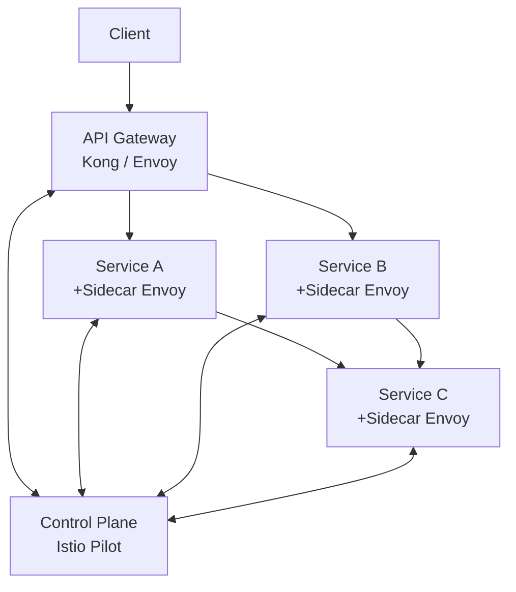

import Tldr from '../../components/content/Tldr.astro';
import Capacity from '../../components/content/Capacity.astro';
import Pitfall from '../../components/content/Pitfall.astro';
import Curveball from '../../components/content/Curveball.astro';
import TradeoffTable from '../../components/content/TradeoffTable.astro';
import Mermaid from '../../components/content/Mermaid.astro';
import Bookmark from '../../components/content/Bookmark.astro';
import RelatedQuestions from '../../components/content/RelatedQuestions.astro';

<Bookmark slug="api-gateway" title="Design an API Gateway / Service Mesh" />

<Tldr>
- **API Gateway = north-south traffic** (client → services). **Service Mesh = east-west traffic** (service → service). They solve different problems; production systems need both.
- **Retry budgets, not retry counts**: if 20% of requests are failing and every client retries 3×, you generate 3× traffic — making the outage worse. Budget = max 10% of total RPS can be retries.
- **Circuit breaker states**: Closed → Open (after threshold failures) → Half-Open (probe with 1 request) → Closed (if probe succeeds). Never implement retries without a circuit breaker.
- **mTLS in service mesh**: sidecar proxy (Envoy/Linkerd) handles TLS handshake automatically — services don't need TLS code. Zero-trust: every service call is authenticated and encrypted.
- **Traffic shifting for canary**: route 5% of traffic by header, user cohort, or random to the new version. Shift gradually (5% → 20% → 50% → 100%) with automatic rollback on error rate increase.
</Tldr>

## API Gateway vs Service Mesh

These two components are often conflated in interviews, and conflating them in production costs you. They handle fundamentally different traffic directions and different failure modes.

**API Gateway** is your north-south boundary: the single entry point where external clients — browsers, mobile apps, third-party integrations — cross into your infrastructure. It handles concerns that only make sense at the perimeter: SSL termination (so internal traffic can be plain HTTP), external authentication (validating JWTs or OAuth2 tokens issued by your identity provider), API key management, request routing to the correct backing service, and rate limiting to protect against abuse. The gateway speaks the public API contract and can version-route `v1/` requests to a legacy service while `v2/` goes to a rewrite. Examples: Kong, AWS API Gateway, Nginx Plus, Netflix Zuul.

**Service Mesh** is your east-west fabric: it governs how microservices communicate with each other after the gateway has already admitted the request. The mesh operates via sidecars — a lightweight proxy (almost always Envoy) is injected alongside every service pod. All inbound and outbound traffic flows through that sidecar, making the mesh transparent to application code. The mesh provides mutual TLS (every service proves its identity to every peer), fine-grained observability (distributed traces spanning dozens of hops), load balancing with circuit breaking, and traffic-weighted routing for canary deploys. Examples: Istio (control plane) + Envoy (data plane), Linkerd, AWS App Mesh.

Why do you need both and not one or the other? The API Gateway is the wrong place to enforce mTLS between your inventory and payment services — it doesn't sit in that traffic path. Conversely, the service mesh is the wrong place to validate an external OAuth2 token or enforce a per-tenant rate limit, because by the time the mesh sidecar sees a request, the gateway has already accepted and forwarded it. The concerns are architecturally distinct: gateway handles the **trust boundary** between the internet and your system; the mesh handles the **trust model** within your system. Running both is not belt-and-suspenders redundancy — they are complementary components with non-overlapping responsibilities. A common senior-interview trap is proposing one to replace the other. Don't fall into it.

## Clarifying questions

Get these answered before drawing any boxes:

| Question | Ideal answer to probe for | Why it matters |
|---|---|---|
| Public-facing API or internal service mesh? | Both — clarify which layer you're designing first | Drives whether you're talking north-south (gateway) or east-west (mesh) |
| Authentication method? | JWT (stateless), OAuth2 (introspection), API key, mTLS client certs | JWT validation at gateway is cheap; OAuth2 introspection adds a round-trip; each has latency implications |
| Rate limiting granularity? | Global, per-user, per-API-key, per-route, per-tenant | Per-key at high cardinality (100 M keys) requires Redis sharding strategy |
| Do we need canary deploys / traffic shifting? | Yes for any CI/CD-mature org | Requires VirtualService abstractions (Istio) or weighted upstreams (Kong); not a late add-on |
| Observability requirements? | Distributed traces per route, per-hop latency histograms | Determines whether you need OpenTelemetry propagation at the gateway and mesh layers |
| Protocol support needed? | HTTP/1.1, HTTP/2, gRPC, WebSocket | gRPC requires HTTP/2 end-to-end; WebSocket breaks naive load balancers; each needs explicit config |
| Multi-region or single region? | Multi-region active-active | Changes how you replicate rate limit counters and circuit breaker state; sidecar certs need cross-region PKI |
| Existing service discovery mechanism? | Kubernetes (most likely), Consul, Eureka | Drives upstream discovery — Envoy integrates natively with k8s via xDS; Consul has its own adapter |

## Functional requirements

- **Request routing** — Match incoming requests by path, header, query parameter, or method and forward to the correct upstream service or subset of instances.
- **Authentication and authorization** — Validate JWTs, API keys, or OAuth2 tokens at the gateway. Enforce service-to-service authorization policies (e.g., service A may not call service D) at the mesh layer via mTLS identity.
- **Rate limiting** — Enforce per-user, per-API-key, and per-route quotas. Return `429 Too Many Requests` with `Retry-After` on breach.
- **SSL/TLS termination** — Terminate external HTTPS at the gateway; re-encrypt with mTLS inside the mesh.
- **Request transformation** — Add/remove/rewrite headers, strip path prefixes, transform request/response bodies for API versioning.
- **Traffic shifting** — Route weighted percentages of traffic between service versions for canary deploys and A/B tests, with automatic rollback.
- **Circuit breaking** — Detect failing upstreams and stop sending requests during the open state; probe with a single request in half-open state.
- **Load balancing** — Distribute traffic across healthy instances using configurable algorithms (round-robin, least-connections, consistent hash).

## Non-functional requirements

- **Latency overhead** — < 1 ms additional latency per hop at p99. Envoy in production adds ~0.5 ms; exceeding 1 ms at p99 is a red flag for configuration issues, not an architectural constant.
- **Throughput** — Handle 1 M req/sec through the gateway tier with horizontal scaling; no single-instance ceiling.
- **Availability** — 99.99% gateway availability (52 minutes downtime/year). A gateway outage takes down every service behind it — it is a higher-availability target than most individual services.
- **Zero-downtime config updates** — Route changes, plugin updates, and certificate rotations must apply without dropping in-flight connections. Envoy's xDS protocol enables hot reloads.
- **Circuit breaker response time** — Sub-second detection: open the circuit within one sliding window evaluation cycle (typically 5-10 seconds of sustained failure, not minutes).
- **Sidecar overhead** — Mesh proxy adds < 10 MB RAM and < 1% CPU per pod at 10 K req/sec. Sidecar resource consumption compounds across hundreds of pods — it must be bounded.

## Capacity estimation

<Capacity title="Gateway and mesh sizing at 1 M req/sec">

**Gateway latency budget**

Target: $p_{99} < 1\text{ ms}$ additive overhead per hop. Envoy's median overhead is:

$$
t_{\text{envoy}} \approx 0.3\text{ ms median},\quad 0.5\text{ ms at }p_{99},\quad 2\text{ ms at }p_{99.9}
$$

Two hops (gateway + one sidecar) → $\approx 1\text{ ms}$ at $p_{99}$, which fits the budget. Deep call chains (5+ hops) push you into multi-millisecond territory at high percentiles — this is why service graph depth matters.

**Rate limiter throughput**

$$
\text{checks/sec} = \underbrace{10^8}_{\text{API keys}} \times \underbrace{10}_{\text{req/s budget each}} = 10^9 \text{ checks/sec (theoretical)}
$$

In practice, active keys at any moment are 0.01% of total: $10^8 \times 10^{-4} = 10^4$ active keys. At 10 req/s each: $10^5$ Redis ops/sec per shard. A single Redis node handles $\sim 500\text{ K ops/sec}$, so 1 shard is sufficient for this load; horizontal sharding is a capacity choice, not a mandatory architecture.

**Sidecar resource budget**

$$
\text{RAM per cluster} = \underbrace{N_{\text{pods}}}_{\text{e.g. 500}} \times \underbrace{8\text{ MB}}_{\text{Envoy baseline}} = 4\text{ GB incremental RAM}
$$

At 10 K req/sec per pod, Envoy burns roughly 0.01 CPU core. 500 pods → 5 extra CPU cores cluster-wide for mesh overhead. This is the number to put in front of your infrastructure team when justifying the mesh.

**TLS handshake amortization**

New TLS (mTLS) handshake: $\approx 10\text{ ms}$ per connection. HTTP/2 multiplexing sustains 100–1000 requests per connection before teardown. Effective TLS overhead per request:

$$
t_{\text{tls per req}} = \frac{10\text{ ms}}{500\text{ req/conn}} = 0.02\text{ ms}
$$

At this amortization rate, mTLS overhead is negligible. The failure mode is short-lived connections (e.g., connection-per-request anti-pattern) where every request pays the full 10 ms handshake.

</Capacity>

## API design (Gateway management API)

The control plane exposes a management API to configure routing, plugins, and traffic policies. This is the operational surface your platform team interacts with.

```
POST   /routes
PUT    /routes/{id}
DELETE /routes/{id}
PUT    /routes/{id}/traffic
POST   /plugins/rate-limit
POST   /plugins/auth
DELETE /plugins/{pluginId}
GET    /health/circuit-breakers
GET    /health/circuit-breakers/{upstreamId}
POST   /keys
DELETE /keys/{keyId}
```

**`POST /routes`** — Define a route: path pattern matching rule, upstream service name (resolved via service discovery), load balancer policy, and an ordered list of plugin references.

```json
{
  "routeId": "payments-v1",
  "pathPattern": "/api/v1/payments/**",
  "upstreamService": "payments-service",
  "loadBalancerPolicy": "least-connections",
  "plugins": ["jwt-auth", "payments-rate-limit"]
}
```

**`PUT /routes/{id}/traffic`** — Set a traffic split for canary deploys. Weights must sum to 100.

```json
{
  "weights": [
    { "subset": "stable", "weight": 95 },
    { "subset": "canary", "weight": 5 }
  ],
  "rollbackTrigger": {
    "errorRateThreshold": 0.01,
    "windowSeconds": 300
  }
}
```

**`GET /health/circuit-breakers`** — Operational endpoint returning the state of every circuit breaker tracked by the gateway. Useful for dashboards and alerting. Returns an array of `{ upstreamId, state: "CLOSED"|"OPEN"|"HALF_OPEN", failureRate, openedAt }`.

**`POST /keys`** — Provision a new API key tied to a tenant, with associated quota tier and optional expiry. Returns the key value (shown once) and a keyId for future management.

## Data model

**Route configuration** (stored in etcd or the gateway's config store, watched by all gateway instances via xDS):

```
Route {
  routeId:          string (UUID)
  pathPattern:      string        // e.g. "/api/v1/payments/**"
  upstreamService:  string        // name resolved via service discovery
  loadBalancerPolicy: enum        // ROUND_ROBIN | LEAST_CONN | WEIGHTED | CONSISTENT_HASH
  hashKey:          string?       // header or cookie for consistent hash
  plugins:          Plugin[]      // ordered list; executed left to right on ingress
  trafficWeights:   Weight[]?     // null = no split; set for canary
  updatedAt:        timestamp
}
```

**Rate limit counter** (Redis ZSET for sliding window, per-apiKey per-route per-window):

```
Key:   rl:{apiKey}:{routeId}:{windowStart}
Type:  ZSET where member = requestId, score = timestamp_ms
TTL:   window_duration_seconds * 2
```

The ZSET approach enables accurate sliding window counts via `ZCOUNT key (now-window) now`. A leaner alternative: two integer counters (current window + previous window) for O(1) memory at the cost of ~2% over-counting at window boundaries.

**Circuit breaker state** (in-memory per gateway/sidecar instance; not shared — each proxy makes its own decision):

```
CircuitBreaker {
  upstreamId:     string
  state:          CLOSED | OPEN | HALF_OPEN
  failureCount:   int
  totalCount:     int            // for failure rate = failureCount / totalCount
  lastStateChange: timestamp
  cooldownUntil:  timestamp?     // set when state transitions to OPEN
}
```

**mTLS certificates** (managed by cert-manager in Kubernetes, backed by SPIRE or Vault):

```
WorkloadIdentity {
  spiffeId:      string    // e.g. "spiffe://cluster.local/ns/payments/sa/payments-svc"
  certificate:   X.509
  privateKey:    (never leaves the pod)
  issuedAt:      timestamp
  expiresAt:     timestamp  // typically issuedAt + 24h
  trustBundle:   X.509[]    // CA certs for validating peers
}
```

Certificates rotate automatically before expiry. The sidecar re-fetches a new cert from the control plane (Istiod or SPIRE agent) without restarting the application.

## High-level architecture

<Mermaid>

</Mermaid>

The API Gateway sits at the perimeter and is the first hop for all external requests. It runs as a dedicated fleet of instances (not as a sidecar) because it needs to handle SSL termination and external auth before handing off to the mesh. Behind the gateway, every service pod runs with an Envoy sidecar injected by the mesh control plane. The control plane (Istiod in Istio) pushes xDS configuration to every sidecar and to the gateway: routing rules, endpoint lists from service discovery, certificate updates, and traffic policies. Data plane traffic (your actual requests) never touches the control plane — it flows sidecar-to-sidecar directly. The control plane is the configuration bus, not the request bus.

## Deep dives

### Request routing and load balancing

Route matching evaluates rules in priority order. Most gateways support four match types, applied in this precedence: **exact path** (`/api/v1/payments`) beats **prefix** (`/api/v1/**`) beats **regex** (`/api/v[0-9]+/.*`) beats **catch-all**. Header-based matching (`X-Version: v2`) and query-parameter matching (`?format=csv`) are evaluated as additional predicates layered on top of path matching. When multiple routes match, the most specific wins.

Load balancing algorithms each have a distinct use case. **Round-robin** is the correct default: zero state, even distribution, no warm-up behavior. **Least-connections** is better when request duration varies widely (e.g., a mix of 5 ms and 2 s requests) — it avoids piling new work onto instances that are already chewing through long-running requests. **Weighted** routing is what enables canary deploys: 95% to stable, 5% to canary, configured in the VirtualService. **Consistent hash** (typically hashing on a session cookie or user ID) is for when you need sticky routing — the same user always reaches the same backend instance. Avoid sticky routing unless you have a specific technical reason (e.g., in-memory session state); it creates hot spots.

Health checking operates at two levels. **Active health checks**: the gateway sends a synthetic request to each upstream's `/health` endpoint every 5 seconds. Two consecutive failures remove the instance from rotation; one success re-adds it. **Passive health checks** (outlier detection in Envoy): the gateway observes real traffic responses. If an instance returns 5xx on 5 consecutive requests within 10 seconds, it is ejected for 30 seconds. Passive detection is faster to react to real failures; active detection catches instances that are up but receiving no traffic.

### Circuit breaker implementation

The circuit breaker is a state machine that wraps calls to a downstream service. In the **Closed** state, all requests flow through and a sliding window tracks outcomes. When the failure rate exceeds a threshold (e.g., 50% of the last 100 requests failed, or 50% of requests in the last 10 seconds took > 2 s), the circuit transitions to **Open**. In the Open state, all requests fail fast with a fallback response — no request reaches the downstream at all. This is critical: the point of the Open state is to give the downstream service breathing room to recover, not to keep hammering it with traffic that will fail anyway.

After a configurable cooldown (e.g., 30 seconds), the circuit transitions to **Half-Open**. In Half-Open, one probe request is allowed through. If it succeeds, the circuit closes and normal traffic resumes. If it fails, the circuit returns to Open with a reset cooldown. Configuring the number of permitted calls in Half-Open to more than 1 is a Resilience4j feature (`permittedNumberOfCallsInHalfOpenState`) — useful when a single request isn't representative of service health (e.g., connection pool warm-up).

The **bulkhead pattern** is the companion to circuit breaking. Without bulkheads, a slow downstream service exhausts your thread pool or connection pool, starving every other downstream service. Bulkheads allocate separate thread pools (or semaphore limits) per downstream dependency. Service A's thread pool and Service B's thread pool are independent — a 100% timeout rate on Service A has zero impact on the concurrency available for Service B calls. In reactive/WebFlux stacks, bulkheads are implemented as concurrency limits on the scheduler rather than thread pools.

**Retry budgets** deserve more emphasis than they get in interviews. A retry count of 3 feels safe. But if your service handles 100 K req/sec and 20% are failing (20 K failures/sec), and each failed request retries 3×, you're sending 60 K additional requests to an already-overloaded downstream. The correct primitive is a **retry budget**: define that retries may consume at most 10% of total outgoing RPS. Once the retry budget is exhausted, fail fast and don't retry — further retries can only make the situation worse. Implement this with a global counter (Redis or local atomic) that tracks retry RPS; before retrying, check and increment; if over budget, skip the retry.

### mTLS in service mesh

Mutual TLS in a service mesh is radically simpler than rolling your own mTLS between services. The key insight is that the sidecar handles the entire TLS lifecycle — your application opens a plain TCP connection to `localhost:8080`, the sidecar intercepts it, negotiates mTLS with the remote sidecar, and delivers decrypted bytes to the remote application. Application code is unchanged.

Every sidecar is provisioned with a **SPIFFE** identity: a URI-formatted certificate subject like `spiffe://cluster.local/ns/payments/sa/payments-svc`. The certificate is short-lived (24-hour TTL) and issued by the mesh's certificate authority (Istiod or an external Vault PKI). On every service-to-service call, sidecar A presents its cert, sidecar B validates it against the cluster trust bundle, and vice versa. This is genuine mutual authentication — not just server-auth like browser HTTPS.

**Authorization policies** build on top of mTLS identity. In Istio, you can write a policy that says "only services with identity `payments-svc` may call `inventory-svc` on path `/api/internal/**`". The sidecar enforces this at the TCP/HTTP layer before the application even receives the request. This is zero-trust networking in practice: even if an attacker compromises one pod, they cannot make authenticated calls to arbitrary services — the sidecar will reject the attempt because the compromised pod's cert does not match an authorized principal.

Certificate rotation is automatic and transparent. Istiod monitors certificate expiry and pushes new certs to sidecars via xDS before the old ones expire. There is no cert rotation runbook, no cron job, no JIRA ticket — the mesh handles it. The cost of this convenience is that you must operate the control plane with high availability (Istiod replicas with leader election), because sidecars can't refresh certs if the control plane is down. Certificates with 24-hour TTLs provide a 24-hour window to restore the control plane before sidecars start presenting expired certs.

### Traffic shifting for canary deploys

Two routing strategies are used in practice, and they serve different purposes. **Header-based routing** (`X-Canary: true` → route to the new version) is for internal validation: QA engineers, automated smoke tests, and dogfooding by internal employees hit the new version while all production traffic stays on stable. Zero blast radius — if the new version is broken, only the testers with the special header are affected. **Percentage-based routing** is for graduated production rollout: start at 5%, monitor error rates and latency for 30 minutes, advance to 20%, monitor, advance to 50%, then 100%. At each stage, the gateway's traffic weights are updated in the VirtualService config.

**Automatic rollback** is what separates a mature canary deploy from a dangerous one. The rollback trigger is defined alongside the traffic weights: "if the error rate on the canary subset exceeds 1% over a 5-minute window, automatically shift 100% of traffic back to stable and page the on-call." Implementing this requires the gateway to expose per-subset error rate metrics (Envoy's stats module does this natively) and a controller that watches those metrics and updates weights via the management API. Argo Rollouts and Flagger are Kubernetes controllers that implement exactly this pattern on top of Istio.

**Session stickiness** for canary traffic: if your new version has a different data schema or session format, a user who is mid-session must stay on the same version for the duration of their session. Implement this by setting a cookie (`X-Version-Assigned: canary`) on the first request that routes the user to canary, then matching on that cookie for all subsequent requests. This ensures session consistency while still allowing you to gradually expand the canary cohort.

## Java integration

### Spring Cloud Gateway with rate limiting and circuit breaker

```java
package dev.pushkar.gateway;

import org.springframework.cloud.gateway.route.RouteLocator;
import org.springframework.cloud.gateway.route.builder.RouteLocatorBuilder;
import org.springframework.context.annotation.Bean;
import org.springframework.context.annotation.Configuration;
import org.springframework.http.HttpStatus;
import reactor.core.publisher.Mono;
import java.time.Duration;

@Configuration
public class GatewayConfig {

    @Bean
    public RouteLocator routes(RouteLocatorBuilder builder) {
        return builder.routes()
            .route("payments-route", r -> r
                .path("/api/v1/payments/**")
                .filters(f -> f
                    .stripPrefix(2)
                    .addRequestHeader("X-Gateway", "spring-cloud-gateway")
                    .requestRateLimiter(rl -> rl
                        .setRateLimiter(redisRateLimiter())
                        .setKeyResolver(exchange -> Mono.just(
                            exchange.getRequest().getHeaders()
                                .getFirst("X-API-Key"))))
                    .circuitBreaker(cb -> cb
                        .setName("payments-cb")
                        .setFallbackUri("forward:/fallback/payments")))
                .uri("lb://payments-service"))
            .route("orders-route", r -> r
                .path("/api/v1/orders/**")
                .filters(f -> f
                    .retry(config -> config
                        .setRetries(2)
                        .setStatuses(HttpStatus.SERVICE_UNAVAILABLE)
                        .setBackoff(Duration.ofMillis(100), Duration.ofSeconds(1), 2, false)))
                .uri("lb://orders-service"))
            .build();
    }
}
```

Spring Cloud Gateway runs on WebFlux (non-blocking Netty), which is important: a blocking gateway negates most of the latency benefits you're trying to achieve. The `requestRateLimiter` filter integrates with Redis via Reactive Redis — the rate check is a non-blocking EVALSHA call to a Lua script. The `circuitBreaker` filter delegates to Resilience4j. The `retry` filter on the orders route uses exponential backoff (`setBackoff(initialInterval, maxInterval, multiplier, firstBackoffDisabled)`) — `false` for `firstBackoffDisabled` means the first retry is immediate; subsequent retries back off. Always cap `setRetries` at 2-3 and pair it with a circuit breaker, or you defeat the retry budget model.

### Resilience4j circuit breaker for service-to-service calls

```java
package dev.pushkar.gateway;

import io.github.resilience4j.circuitbreaker.CircuitBreaker;
import io.github.resilience4j.circuitbreaker.CircuitBreakerConfig;
import io.github.resilience4j.circuitbreaker.CircuitBreakerRegistry;
import io.github.resilience4j.reactor.circuitbreaker.operator.CircuitBreakerOperator;
import org.springframework.beans.factory.annotation.Value;
import org.springframework.stereotype.Service;
import org.springframework.web.reactive.function.client.WebClient;
import reactor.core.publisher.Mono;
import io.github.resilience4j.circuitbreaker.CallNotPermittedException;
import java.time.Duration;

@Service
public class InventoryClient {
    private final CircuitBreaker cb;
    private final WebClient webClient;

    public InventoryClient(CircuitBreakerRegistry registry,
                            WebClient.Builder builder,
                            @Value("${inventory.url}") String inventoryUrl) {
        this.cb = registry.circuitBreaker("inventory",
            CircuitBreakerConfig.custom()
                .failureRateThreshold(50)        // Open if 50% of last 100 calls fail
                .slowCallRateThreshold(50)       // Also open if 50% take > 2s
                .slowCallDurationThreshold(Duration.ofSeconds(2))
                .waitDurationInOpenState(Duration.ofSeconds(30))
                .permittedNumberOfCallsInHalfOpenState(3)
                .build());
        this.webClient = builder.baseUrl(inventoryUrl).build();
    }

    public Mono<InventoryStatus> checkStock(String productId) {
        return Mono.fromCallable(() -> productId)
            .transformDeferred(CircuitBreakerOperator.of(cb))
            .flatMap(id -> webClient.get()
                .uri("/inventory/{id}", id)
                .retrieve()
                .bodyToMono(InventoryStatus.class))
            .onErrorReturn(CallNotPermittedException.class,
                InventoryStatus.unknown()); // fallback when circuit is open
    }
}
```

The `slowCallRateThreshold` is the setting most engineers miss. A circuit breaker that only opens on errors will not protect you from a downstream that is responding with 200 OK but taking 8 seconds per call — that's a latency-induced cascade, not a hard failure. Setting `slowCallDurationThreshold(Duration.ofSeconds(2))` plus `slowCallRateThreshold(50)` means: if 50% of calls take more than 2 seconds, open the circuit. This covers the common production failure mode where a database is overloaded and returning results slowly before timing out entirely. `permittedNumberOfCallsInHalfOpenState(3)` sends three probes instead of one, which gives a more statistically reliable signal before fully closing the circuit.

<TradeoffTable
  rows={[
    {
      approach: "Nginx (DIY)",
      latency: "Very low (~0.1ms)",
      opsComplexity: "High",
      features: "Basic routing, SSL, load balancing only",
      bestFor: "High-performance static routing, teams with Nginx expertise"
    },
    {
      approach: "Kong (plugin-based)",
      latency: "Low (~0.5ms)",
      opsComplexity: "Medium",
      features: "Rich plugin ecosystem (auth, rate limit, transforms, observability)",
      bestFor: "SMB to enterprise API management, polyglot service teams"
    },
    {
      approach: "AWS API Gateway",
      latency: "Medium (~2ms)",
      opsComplexity: "Very low (managed)",
      features: "Good — auth, throttling, caching, WebSocket support",
      bestFor: "Serverless / AWS-native stacks, teams that want zero gateway ops"
    },
    {
      approach: "Istio + Envoy",
      latency: "~0.5ms per hop",
      opsComplexity: "High (Kubernetes required)",
      features: "Full service mesh — mTLS, tracing, canary, circuit breaking, policy",
      bestFor: "Microservices at scale, organizations needing zero-trust networking"
    },
    {
      approach: "Spring Cloud Gateway",
      latency: "~1ms",
      opsComplexity: "Medium",
      features: "Java-native integration with Spring ecosystem, Resilience4j, WebFlux",
      bestFor: "Spring Boot shops that want gateway logic in the same codebase"
    }
  ]}
/>

<Pitfall title="Retry amplification — the 3×3 multiplier">
If Service A retries failed calls to Service B 3×, and Service B also retries failed calls to Service C 3×, a 1% failure at Service C generates 9× the traffic at Service C (3 × 3 = 9). At 10% failure rate with three-tier deep retry stacks, you can generate 27× amplification. This is how a minor database hiccup becomes a full system outage: every layer is helpfully retrying, collectively overwhelming the struggling dependency.

The fix has two parts. First, use **retry budgets**: define that retries may consume at most 10% of outgoing RPS per service. Once the budget is exhausted, return the error immediately without retrying. Second, use **idempotency keys** on mutating operations so that retries don't cause duplicate side effects (double charges, duplicate orders). A retry budget without idempotency just means you get fewer duplicates; idempotency without a retry budget means you still amplify load but at least you don't corrupt data.
</Pitfall>

<Pitfall title="Putting business logic in the API Gateway">
The gateway is an irresistibly convenient place to add logic: it sees every request, it has access to auth context, it runs before any service. This makes it tempting to add payment amount validation, discount calculation, response enrichment from a database call, or user tier lookups directly in the gateway.

Don't. Every piece of business logic in the gateway creates a distributed monolith: the gateway now has a deployment dependency on business rule changes, the gateway team becomes a bottleneck for product changes, and gateway bugs can silently corrupt data for all services simultaneously. The gateway is a cross-cutting concerns layer — its job is auth, rate limiting, routing, and observability plumbing. If you find yourself writing an if/else in the gateway that references a business concept (order, payment, user tier, discount), that logic belongs in a service. Push it downstream and have the gateway forward the enriched auth context (user ID, tier from the JWT claims) in a header.
</Pitfall>

<Curveball title="Circuit breaker cooldown vs. early recovery">
Service B goes down. Service A's circuit breaker opens with a 30-second cooldown. Service B recovers at second 25 — but the circuit breaker won't probe until second 30. For those 5 seconds, Service A is unnecessarily failing all requests with the fallback response, even though Service B is healthy.

The standard answer is: **the circuit breaker doesn't know**. That's by design. The cooldown is a conservative mechanism that prioritizes not re-hammering a recovering service over minimizing unnecessary fallback time. The real fix is to make the fallback cost low (serve stale data, return a degraded response) so that 5 extra seconds on the fallback is acceptable.

For more sophisticated systems: (1) implement **active health checks** that run on a separate timer — if the health check succeeds during the cooldown, transition to Half-Open early; (2) use a shorter cooldown (10 s) with more probes in Half-Open (5) to balance responsiveness with protection; (3) implement **progressive recovery** where the circuit moves through 1%, 10%, 50%, 100% traffic weights rather than a binary open/close transition. Envoy's outlier detection with `base_ejection_time` and `max_ejection_percent` implements a version of this.
</Curveball>

<Curveball title="Sticky canary routing for A/B testing checkout">
You want 10% of users to see a new checkout flow backed by a different service. The new version has a different session format, so a user who gets routed to it mid-session must stay on it for their entire session — you can't alternate between versions per-request.

**Step 1 — Assignment**: On the first request from a user (identified by user ID from the JWT), use a deterministic hash (`hash(userId) % 100 < 10`) to assign them to the canary cohort. Store this assignment in a Redis key `canary-cohort:{userId}` with a TTL matching your session lifetime (e.g., 24 hours). Return a `Set-Cookie: X-Checkout-Version=v2; SameSite=Lax` header.

**Step 2 — Routing**: All subsequent requests present the cookie. The gateway's route matching reads the cookie value and routes to the appropriate service version. This is header-based routing — the gateway doesn't need to hit Redis again on subsequent requests.

**Step 3 — Cohort consistency**: Because the assignment is hash-based, the same user always gets the same answer from `hash(userId) % 100` — even if you restart the gateway or the Redis key expires and gets re-evaluated. The cookie is belt-and-suspenders for session duration; the hash is the ground truth for cohort membership.

The trap to avoid: don't use random assignment per-request without a cookie. That produces a user who sees v1 on request 1, v2 on request 2, v1 on request 3 — which destroys the validity of your A/B test and creates broken session state.
</Curveball>

<Curveball title="Debugging 50ms p99 latency at the gateway">
Your API gateway is adding 50 ms at p99 (target is < 1 ms). The top three places to look, in investigation order:

**1. Upstream DNS resolution** — If the gateway resolves the upstream service hostname on every request instead of caching it, each request pays a DNS round-trip (often 20-50 ms on misconfigured resolvers). Check: does the gateway use connection pooling with a pre-resolved upstream address, or is it calling `getaddrinfo()` per request? In Kubernetes, ensure the gateway uses the service cluster IP (stable, no DNS) or has DNS caching (ndots:5 is the default k8s config and causes multiple DNS lookups per request for short hostnames).

**2. TLS renegotiation or connection-per-request anti-pattern** — If the gateway opens a new TCP+TLS connection to the upstream on every request, you pay ~10 ms TLS handshake + TCP three-way handshake on every request. Check: is connection pooling enabled? Are keep-alive timeouts on the upstream service killing connections faster than the pool can reuse them?

**3. Blocking operations on the event loop** — Spring Cloud Gateway on WebFlux, or Envoy running a custom Lua/WASM plugin, can show p99 spikes if any operation blocks the event loop: a synchronous Redis call, a blocking JWT validation library, or a Lua plugin doing a synchronous HTTP call to an auth service. Check: gateway CPU utilization during p99 spikes (blocking = high CPU on one thread, other threads idle); check thread dump for blocked threads.

The 50 ms threshold is almost always DNS or connection management — sub-millisecond at p50 but catastrophic at p99 because the slow path is only triggered on cache miss or pool exhaustion.
</Curveball>

## Further reading

- **Envoy Proxy documentation** — The canonical reference for xDS protocol, circuit breaking config, outlier detection, and traffic splitting. The architecture overview explains the listener → filter chain → cluster model that underpins most modern gateways. `envoyproxy.io/docs`

- **Istio architecture guide** — Covers the control plane / data plane split, xDS API, certificate management via Istiod, and AuthorizationPolicy for zero-trust enforcement. The traffic management concepts section maps directly to interview questions about VirtualService, DestinationRule, and Gateway resources. `istio.io/latest/docs/concepts`

- **Netflix Hystrix (and the transition to Resilience4j)** — Hystrix's wiki remains the best conceptual introduction to circuit breakers, bulkheads, and fallback patterns even though Hystrix itself is no longer maintained. The failure-tolerance patterns it defines are exactly what Resilience4j implements. `github.com/Netflix/Hystrix/wiki`

- **Google SRE Book, Chapter 21: Handling Overload** — The definitive treatment of load shedding, retry budgets, and why client-side throttling is necessary in addition to server-side rate limiting. Free online. The section on "criticality" (the idea that not all requests deserve equal retry effort) is directly applicable to API gateway design. `sre.google/sre-book/handling-overload`

- **SPIFFE and SPIRE** — The specification behind workload identity in service meshes. Understanding SPIFFE IDs and the SVID (SPIFFE Verifiable Identity Document) format clarifies why mTLS in a mesh is more than just encryption — it's a cryptographically verified identity system. `spiffe.io/docs`

<RelatedQuestions items={[{slug: "distributed-rate-limiter", title: "Design a Distributed Rate Limiter", difficulty: "mid"}, {slug: "cdn-design", title: "Design a CDN", difficulty: "senior"}, {slug: "metrics-monitoring", title: "Design a Metrics & Monitoring System", difficulty: "senior"}]} />
