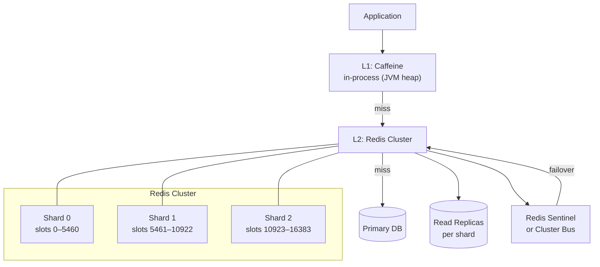
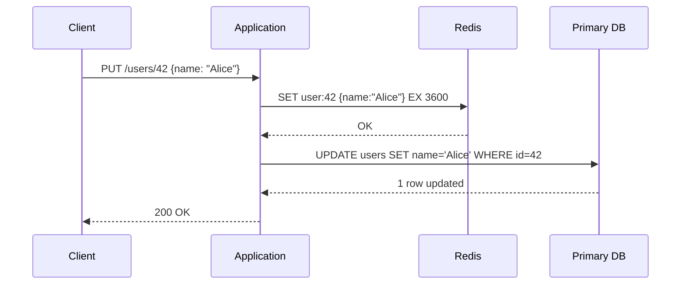

import Tldr from '../../components/content/Tldr.astro';
import Capacity from '../../components/content/Capacity.astro';
import Pitfall from '../../components/content/Pitfall.astro';
import Curveball from '../../components/content/Curveball.astro';
import TradeoffTable from '../../components/content/TradeoffTable.astro';
import Diagram from '../../components/content/Diagram.astro';
import Mermaid from '../../components/content/Mermaid.astro';
import Bookmark from '../../components/content/Bookmark.astro';
import RelatedQuestions from '../../components/content/RelatedQuestions.astro';

<Bookmark slug="design-a-cache" title="Design a Distributed Cache" />

<Tldr>
- **Eviction**: LRU is the default (O(1) with a doubly-linked list + hash map), but LFU beats it for skewed access patterns like social media feeds where cold content otherwise gets a free ride
- **Write-through** (synchronous write to DB + cache) is safe at the cost of higher write latency; **write-back** (async flush) is fast but risks data loss on crash — pick based on your durability SLA
- **Hot keys**: layer a local in-process Caffeine cache (30 s TTL) in front of Redis to absorb celebrity-account reads without touching the network at all
- **Consistent hashing** for sharding — virtual nodes make rebalancing cost O(k/n) instead of O(n), meaning adding a node only moves a fraction of keys
- **Cache stampede**: probabilistic early expiry (XFetch algorithm) or a Redis `SET NX` lock prevents thundering herds when a popular key expires simultaneously for thousands of callers
</Tldr>

## Why a distributed cache?

Every system has a storage hierarchy, and the economics are brutally simple: DRAM costs roughly $5 per GB and delivers microsecond access latency, while an SSD costs $0.10 per GB with millisecond latency, and a cloud-managed relational database adds network round-trips, lock contention, and connection pool overhead on top of that. A cache exploits the observation that a tiny fraction of your data absorbs a disproportionate fraction of your reads — the 80/20 rule is usually closer to 95/5 in production traffic. If you can keep that hot 5% in memory, you eliminate the vast majority of database load without any application logic changes beyond a `get(key)` call.

Distributed caches take this further by spreading the in-memory dataset across a cluster of nodes, providing a pool of memory that scales horizontally and tolerates individual node failures. This is the engineering abstraction that allows a single user-profile lookup to complete in under a millisecond even at tens of millions of daily active users — the profile is fetched from RAM on a nearby Redis node rather than joining three normalized tables under lock. Facebook's Memcached deployment, documented in their 2013 NSDI paper, was serving over a billion requests per second across thousands of nodes by the time it was published. The fundamental insight — that read amplification can be absorbed by memory before it ever reaches the database — remains as relevant today as it was then.

The flip side is that a cache is not a primary store. It is a performance optimization that carries a correctness risk: the cache can serve stale data. Understanding where that risk is acceptable (a tweet's like count, a product catalog page) versus where it is not (a bank balance, a session invalidation) is the staff-level judgment call that separates a cache design conversation from a distributed KV-store design conversation. This article is about the former.

## Clarifying questions

Before drawing any boxes, get these answers. The responses dramatically change the architecture.

| Question | Ideal answer to probe for | Why it changes the design |
|---|---|---|
| What are we caching? | Query results, session tokens, computed aggregates, HTML fragments | Shapes key schema and value size distribution |
| Read:write ratio? | 100:1 is typical; if it's 1:1 you may not need a cache at all | Determines whether write amplification from write-through is acceptable |
| What consistency model? | Strong (cache always reflects DB), eventual (TTL-based expiry), or read-your-own-writes | Drives write strategy selection; strong consistency requires synchronous invalidation |
| Key-value only, or richer structures? | Sorted sets (leaderboards), streams (event log), pub/sub (chat), bitmaps (feature flags) | Redis supports all of these; Memcached is pure KV — structure requirements force the technology choice |
| Persistence required? | RDB snapshots (point-in-time), AOF log (near-zero RPO), or none (ephemeral) | Persistence trades throughput for durability — AOF with `fsync=always` cuts write throughput by ~3x |
| Maximum memory budget? | E.g., 128 GB per node, 10 nodes = 1.28 TB cache pool | Determines shard count and eviction aggressiveness |
| Multi-region? | Active-active across US, EU, APAC | Adds replication lag as a consistency dimension; cross-region write-through is latency-prohibitive |
| Eviction policy preference? | LRU for general workloads, LFU for frequency-skewed feeds, no-eviction for session stores | Mismatched eviction policy is one of the top causes of cache thrash in production |

The answers to these questions collapse a large design space. A session store with no-eviction, AOF persistence, and strong consistency looks nothing like a Caffeine-backed CDN fragment cache.

## Functional requirements

- `GET key` — returns value or nil; O(1) average case
- `SET key value [EX seconds]` — sets a key with optional TTL; overwrites if exists
- `DEL key [key...]` — deletes one or more keys atomically
- `MGET key [key...]` — batched multi-get in a single round-trip; reduces client-side fan-out overhead
- `PIPELINE` / `MULTI-EXEC` — batch or transactional grouping of commands to reduce RTTs
- `TTL key` — inspect remaining time-to-live; `-1` means no expiry, `-2` means key does not exist
- Pluggable eviction policies: `LRU`, `LFU`, `FIFO`, `random`, `allkeys-lru`, `volatile-lru`
- Cache hit/miss metrics per key prefix and globally, exposed via a stats endpoint or Prometheus scrape
- Cluster membership changes (add/remove node) must not require application restarts or full cache flushes

## Non-functional requirements

- **Latency**: p99 GET < 1 ms, p50 GET < 200 µs, measured at the client
- **Availability**: > 99.99% (< 52 min/year), requiring HA replica failover in under 30 s
- **Throughput**: support 1 M ops/sec per cluster; each Redis node can handle 100 K–500 K ops/sec depending on value size and pipeline depth
- **Durability**: configurable — default is best-effort (no persistence), optional RDB snapshots every 60 s, optional AOF with `fsync=everysec` (< 1 s RPO)
- **Scalability**: horizontal sharding must support adding or removing nodes with < 5% key movement and zero downtime
- **Memory efficiency**: overhead per key should be < 100 bytes for small string values (Redis achieves ~64 bytes overhead per key in practice)
- **Observability**: keyspace hit rate, evicted keys/sec, memory fragmentation ratio, and connected clients must be available in real time

## Capacity estimation

<Capacity title="Cache sizing">

**Working set size**

Assume a primary database of 500 GB. Industry experience puts the hot working set at roughly 20% of total data:

$\text{Hot data} = 500\ \text{GB} \times 0.20 = 100\ \text{GB}$

With a 10% safety margin for key overhead, pointer tables, and fragmentation:

$\text{Cache pool target} = 100\ \text{GB} \times 1.10 = 110\ \text{GB}$

Using 128 GB nodes (e.g., `r7g.4xlarge` on AWS with 128 GB RAM, ~$1.00/hr on-demand):

$\text{Nodes for data} = \lceil 110 / 128 \rceil = 1\ \text{primary shard}$

Add one replica per primary for HA, plus one standby for rolling upgrades:

$\text{Minimum cluster size} = 3\ \text{nodes}$

**Throughput**

Target: 1 M ops/sec cluster-wide. A single Redis node (single-threaded command loop) handles roughly:

$\text{Capacity per node} \approx 100{,}000\text{–}500{,}000\ \text{ops/sec}$

Conservative estimate (mixed GET/SET with 1 KB average value size, pipelining depth of 10):

$\text{Nodes needed} = \lceil 1{,}000{,}000 / 200{,}000 \rceil = 5\ \text{nodes}$

**Network bandwidth**

$\text{Bandwidth per node} = 200{,}000\ \text{ops/sec} \times 1\ \text{KB} = 200\ \text{MB/s} \approx 1.6\ \text{Gbps}$

A 10 GbE NIC (standard on cloud instances) provides headroom. Pipeline compression helps further at high value sizes.

**Summary**

A 10-node cluster (5 primary + 5 replica) of `r7g.4xlarge` instances delivers 1 M ops/sec with 640 GB of addressable cache space, well above the 110 GB working set.

</Capacity>

## API design

The public interface should be familiar to any Redis client. The key discipline at the staff level is keeping the API surface minimal — every operation you expose becomes a contract you must maintain under cluster reconfiguration.

```
GET key
  → value | nil

SET key value [EX seconds] [NX | XX] [GET]
  → OK | nil (if NX/XX condition not met)

DEL key [key ...]
  → (integer) number of keys deleted

MGET key [key ...]
  → array of values (nil for missing keys), same ordering as input

SETEX key seconds value
  → OK   (shorthand for SET key value EX seconds)

EXPIRE key seconds
  → (integer) 1 if TTL set, 0 if key does not exist

TTL key
  → (integer) seconds remaining | -1 no expiry | -2 key missing

PIPELINE
  → client batches N commands, single TCP flush, server processes in order
  → reduces N RTTs to 1 RTT at the cost of head-of-line blocking within the batch

MULTI / EXEC
  → atomic transaction — all commands execute or none do (no partial writes)
  → useful for check-and-set patterns (e.g., leaderboard update)
```

The `NX` flag on `SET` (set if Not eXists) is the foundation of distributed locking — it is how Redis-based locks like Redlock are implemented. Understanding this flag is often a follow-up in a staff interview.

## Data model

Understanding the internal data model separates candidates who have used Redis from those who understand it.

**The top-level dictionary**

Redis maintains one hash table (`dict`) per logical database (default: db 0). Each entry maps a `sds` (Simple Dynamic String) key to a `robj` (Redis object). The `robj` carries a type tag, an encoding tag, and a pointer to the underlying data structure. The encoding tag is where Redis squeezes memory — a sorted set of 128 elements with values under 64 bytes will be stored as a `listpack` (flat array, cache-friendly) rather than a skiplist.

**String encoding**

Strings are stored as `EMBSTR` (inline in the `robj`, for values ≤ 44 bytes, single allocation), `RAW` (heap `sds`, for longer values), or `INT` (a native C `long`, zero allocation) when the value parses as an integer. This is why incrementing a counter with `INCR` is so fast — Redis never serializes or deserializes.

**Sorted sets**

For small cardinality (< 128 members, values < 64 bytes): `listpack`, a contiguous array of `(element, score)` pairs. O(N) operations, but N is bounded and the flat memory layout wins on CPU cache lines.

For large cardinality: a `skiplist` (O(log N) rank queries) paired with a `dict` for O(1) member lookup. The skiplist enables range queries (`ZRANGEBYSCORE`) without a full scan.

**Lists**

Stored as a `quicklist` — a doubly-linked list of `listpack` nodes. Each node holds up to 128 entries (configurable). This hybrid bounds the overhead of pointer chasing while keeping append/prepend at O(1).

**Expiry**

Redis maintains a separate `expires` dict mapping keys to Unix timestamps. On every command, it performs a lazy expiry check: if the key's expiry has passed, it is deleted before the command runs. A background task (`activeExpireCycle`) runs 10 times per second and randomly samples 20 keys from the `expires` dict, deleting expired ones; if more than 25% of sampled keys were expired, it runs again immediately. This probabilistic approach keeps memory from bloating without a full scan.

**LRU clock**

Redis maintains a global 24-bit LRU clock that increments every 1000 ms. Each `robj` stores a 24-bit timestamp of its last access. When eviction is needed, Redis samples a configurable number of keys (default 5) and evicts the one with the oldest LRU timestamp. This is O(1) per eviction decision at the cost of approximation — which is an acceptable tradeoff for a cache.

## High-level architecture

<Mermaid>

</Mermaid>

The two-tier caching model is the production default at large-scale companies. The L1 Caffeine cache lives in the JVM heap and eliminates the network round-trip entirely for hot keys. Its short TTL (30 s) caps stale exposure. The L2 Redis Cluster provides the shared, cross-instance view with a longer TTL (minutes to hours) and persistence. The primary database is only hit on a cold start or after an invalidation event.

Redis Cluster uses a fixed slot space of 16,384 slots, distributed across shards using CRC16(key) mod 16384. Every node knows the slot-to-node mapping via the cluster bus (gossip protocol on port 6379 + 10000 = 16379). Clients receive `MOVED` redirects when they hit the wrong node, and smart clients (Jedis cluster mode, Lettuce) cache the slot map locally to avoid the redirect round-trip on every request.

## Deep dives

### Eviction policies

When Redis hits `maxmemory`, it must free memory before accepting new writes. The eviction policy determines which key dies first.

**LRU (Least Recently Used)**

The canonical algorithm maintains a doubly-linked list ordered by recency of access, with a hash map for O(1) lookup. On access, move the node to the head. On eviction, remove from the tail. Redis implements an approximation: sample N random keys (default 5, tunable to 10 for better accuracy) and evict the one with the oldest LRU clock timestamp. The approximation is within a few percent of true LRU on real workloads and uses no per-key linked-list pointers in the main dict.

Choose `allkeys-lru` when you want the cache to behave like a true working-set cache — keys that stop being accessed will naturally age out regardless of their TTL.

**LFU (Least Frequently Used)**

LFU tracks access frequency rather than recency. Redis uses a logarithmic counter (Morris counter): each access increments the counter probabilistically, with the increment probability decreasing as the counter value grows. This keeps the counter in 8 bits while capturing frequency over multiple orders of magnitude. A decay factor reduces all counters periodically, so a key that was hot six hours ago but has cooled down will eventually be eligible for eviction.

LFU wins over LRU when access patterns are heavily skewed and keys have bursty-then-cold lifecycles — for example, a trending social media post that gets millions of reads in an hour, then goes cold. LRU keeps it alive as long as it was recently read; LFU will let it die once frequency decays. Use `allkeys-lfu` for social feeds, recommendation caches, and viral content scenarios.

**FIFO**

Evicts the key that was written earliest. No access tracking overhead. Appropriate when all cached items have roughly equal value and you want predictable memory behavior. Rarely the right choice in a general cache, but useful for time-windowed buffers (e.g., caching the last 5 minutes of IoT sensor readings).

**volatile-* variants**

All of the above policies have a `volatile-*` counterpart (e.g., `volatile-lru`) that only considers keys with a TTL set, leaving TTL-less keys untouched. Useful when the cache is shared between ephemeral data (with TTL) and long-lived reference data (without TTL) and you want eviction to only touch the ephemeral tier.

### Write strategies

The choice of write strategy is the most consequential design decision for cache consistency.

**Write-through**

Every write goes synchronously to both the cache and the database before the client receives a success response. The cache is always consistent with the database for recently written data. The penalty is write latency — the client waits for two writes. This is the correct default for financial data, user authentication records, and any data where a stale read has a business cost.

<Mermaid>

</Mermaid>

**Write-around**

Writes go directly to the database, bypassing the cache. The cache is only populated on the next read (cache-aside / lazy loading). Avoids polluting the cache with data that may never be read again — useful for batch imports, bulk updates, and audit log appends where the written data is unlikely to be immediately read. The tradeoff is a cache miss (and a DB read) on the next access after a write.

**Write-back (write-behind)**

Writes land in the cache immediately; the application acknowledges success. An asynchronous process (or Redis AOF replay) flushes dirty entries to the database on an interval. This is the fastest possible write path and enables absorbing write bursts without overwhelming the database. The risk is real: if the cache node crashes before the flush, those writes are lost. Acceptable for gaming leaderboards, view counters, and session activity timestamps — data where approximate correctness and high write throughput matter more than zero data loss.

### Hot key mitigation

A hot key is a key receiving disproportionate traffic — think the profile of a celebrity with 100 million followers, or the product page of an item featured in a TV ad. The Redis node that owns that key becomes the bottleneck regardless of how well the rest of your cluster is sized.

**L1 local cache (Caffeine)**

The highest-leverage mitigation. An in-process Caffeine cache with a 30-second TTL absorbs reads entirely in the JVM heap, with no network call. At 100 application server instances, each with a warm L1 cache, the Redis node for a hot key goes from receiving N req/s (all 100 instances) to receiving at most 100 / (30 s × req/s) — roughly one request per instance per 30 seconds. The 30-second TTL bounds stale exposure to the same order as many business SLAs.

**Key replication / sharding by suffix**

Shard the hot key across N Redis nodes by appending a random suffix: `user:celebrity:0`, `user:celebrity:1`, ..., `user:celebrity:N-1`. On write, fan out to all N nodes. On read, pick a random suffix. This distributes the read load across N nodes at the cost of N writes and the complexity of keeping the N copies in sync. Appropriate when L1 caching is insufficient (e.g., Lambda functions with no warm state, or CLI tools).

**Client-side caching (Redis 6+ RESP3 tracking)**

Redis 6 introduced server-assisted client-side caching via the `CLIENT TRACKING ON` command. The client subscribes to invalidation messages: when a key is modified on the server, Redis pushes an invalidation to all clients tracking that key. Clients can cache the value in-process with no TTL — they rely on invalidation messages rather than polling. This is the most precise approach (no stale window from TTL), but adds complexity and requires RESP3-compatible clients. Useful for configuration and feature-flag caches where staleness is not tolerable but write rates are low.

## Java integration

### Part A — Two-tier cache (Caffeine L1 + Jedis L2)

```java
package dev.pushkar.cache;

import com.github.benmanes.caffeine.cache.Cache;
import com.github.benmanes.caffeine.cache.Caffeine;
import redis.clients.jedis.JedisPool;
import redis.clients.jedis.Jedis;
import java.time.Duration;
import java.util.Optional;

public final class TieredCache<V> {
    private final Cache<String, V> l1;
    private final JedisPool jedis;
    private final Serializer<V> serializer;
    private final int redisTtlSec;

    public TieredCache(JedisPool jedis, Serializer<V> serializer, int redisTtlSec) {
        this.l1 = Caffeine.newBuilder()
            .maximumSize(10_000)
            .expireAfterWrite(Duration.ofSeconds(30))
            .recordStats()
            .build();
        this.jedis = jedis;
        this.serializer = serializer;
        this.redisTtlSec = redisTtlSec;
    }

    public Optional<V> get(String key) {
        V v = l1.getIfPresent(key);
        if (v != null) return Optional.of(v);

        try (Jedis j = jedis.getResource()) {
            byte[] raw = j.get(key.getBytes());
            if (raw == null) return Optional.empty();
            V deserialized = serializer.deserialize(raw);
            l1.put(key, deserialized);
            return Optional.of(deserialized);
        }
    }

    public void put(String key, V value) {
        l1.put(key, value);
        try (Jedis j = jedis.getResource()) {
            j.setex(key.getBytes(), redisTtlSec, serializer.serialize(value));
        }
    }

    public void invalidate(String key) {
        l1.invalidate(key);
        try (Jedis j = jedis.getResource()) {
            j.del(key);
        }
    }

    public interface Serializer<V> {
        byte[] serialize(V v);
        V deserialize(byte[] bytes);
    }
}
```

A few implementation notes worth calling out in an interview. The `try-with-resources` on `Jedis` returns the connection to the pool — a missing `close()` is a common connection leak bug. The `l1.recordStats()` call enables Caffeine's hit-rate counters, which you should expose to your metrics pipeline; a dropping L1 hit rate is the first signal of a working-set shift. The serializer interface is left as a parameter so the caller can plug in Protobuf, Kryo, or Jackson without coupling the cache tier to a serialization framework.

### Part B — Spring Boot cache configuration

```java
@Configuration
@EnableCaching
public class CacheConfig {

    @Bean
    public CacheManager cacheManager(RedisConnectionFactory cf) {
        // L1: Caffeine for fast, in-process
        CaffeineCacheManager caffeineMgr = new CaffeineCacheManager();
        caffeineMgr.setCaffeine(Caffeine.newBuilder()
            .maximumSize(50_000)
            .expireAfterWrite(Duration.ofSeconds(30)));

        // L2: Redis for distributed
        RedisCacheManager redisMgr = RedisCacheManager.builder(cf)
            .cacheDefaults(RedisCacheConfiguration.defaultCacheConfig()
                .entryTtl(Duration.ofMinutes(10))
                .disableCachingNullValues())
            .build();

        return new CompositeCacheManager(caffeineMgr, redisMgr);
    }
}

@Service
public class UserProfileService {

    @Cacheable(value = "userProfiles", key = "#userId")
    public UserProfile getProfile(long userId) {
        return repo.findById(userId).orElseThrow();
    }

    @CacheEvict(value = "userProfiles", key = "#profile.id")
    public void updateProfile(UserProfile profile) {
        repo.save(profile);
    }
}
```

`CompositeCacheManager` checks L1 (Caffeine) first; on miss it falls through to L2 (Redis). `@CacheEvict` on `updateProfile` invalidates both layers because Spring walks through all registered cache managers in order. One subtlety: in a multi-instance deployment, `@CacheEvict` only invalidates the L1 cache on the instance that executed the method. Other instances' L1 caches remain stale until their 30-second TTL expires. This is the fundamental tradeoff of local caching: zero-latency reads against eventual L1 consistency. Explicitly document this in your team's cache contract.

<TradeoffTable
  rows={[
    {
      strategy: "Write-through",
      latency: "Higher (synchronous write to both cache and DB before ack)",
      consistency: "Strong — cache and DB are always in sync for written keys",
      durability: "High — data survives cache eviction, reads always go to DB if cache is cold",
      bestFor: "Financial records, user authentication tokens, inventory counts"
    },
    {
      strategy: "Write-around",
      latency: "Low for writes (single DB write, no cache update)",
      consistency: "Weak — cache lags until next read populates it",
      durability: "High — all writes go to DB; cache is a read-through optimization only",
      bestFor: "Bulk imports, audit logs, write-heavy data rarely re-read"
    },
    {
      strategy: "Write-back",
      latency: "Lowest — write acknowledges after cache update, DB flush is async",
      consistency: "Eventual — DB is behind by the flush interval (seconds to minutes)",
      durability: "Low — crash before flush loses writes since last persistence",
      bestFor: "Gaming leaderboards, view/like counters, session activity timestamps"
    }
  ]}
/>

<Pitfall title="Cache stampede: thundering herd on popular key expiry">
When a high-traffic key expires, every concurrent request that misses the cache will race to compute the value and write it back. With 10,000 req/s hitting a key and a 200 ms DB query to recompute it, you get 2,000 simultaneous DB queries in the window between expiry and repopulation. This is a cache stampede.

Three mitigations, in increasing sophistication:

1. **Redis lock (`SET NX EX`)**: the first thread to acquire the lock recomputes and writes the value; other threads wait or return a stale value. Simple, but adds lock acquisition latency to every miss.

2. **Probabilistic early expiry (XFetch)**: recompute the value slightly before it actually expires, with probability increasing as the expiry approaches. No locks needed. Implemented as: `if (now - beta * log(random())) > expiry_time { recompute() }`. The `beta` parameter (typically 1.0) tunes aggressiveness.

3. **Background refresh**: a scheduled job refreshes popular keys before they expire based on access frequency. Zero miss latency, but requires a separate refresh daemon and knowledge of which keys are popular.

The lock approach is the easiest to implement correctly; XFetch is elegant for stateless services; background refresh is the production choice at very high scale.
</Pitfall>

<Pitfall title="Confusing TTL with a consistency guarantee">
TTL is a memory management hint, not a consistency contract. Setting a 60-second TTL does not mean cached data is at most 60 seconds stale — a key can serve stale data for its entire TTL, and if it gets hot enough to never be evicted, it can serve the same stale value indefinitely (TTL expiry still applies, but a cache miss that gets rehydrated from a stale replica or a read-replica-lagged DB can immediately introduce fresh staleness).

If your SLA says "no stale data older than X seconds," TTL alone is insufficient. You need active invalidation: publish an invalidation event (e.g., via Redis pub/sub or a Kafka topic) whenever the source data changes, and have cache consumers delete the affected key immediately. TTL is then a fallback safety net, not the primary mechanism.
</Pitfall>

<Curveball question="Redis loses power before flushing AOF — how much data can you lose and how do you configure the tradeoff?">
The answer depends entirely on the `appendfsync` configuration:

- `appendfsync always`: every write is `fsync`'d before Redis acknowledges. RPO = 0 (no data loss). Throughput drops to roughly 2,000–5,000 ops/sec (disk IOPS bound). Appropriate for financial ledgers where a single missing write is unacceptable.

- `appendfsync everysec`: `fsync` runs once per second in a background thread. Redis acknowledges writes immediately after writing to the OS buffer. Worst-case loss = 1 second of writes. Throughput remains near in-memory levels (hundreds of thousands of ops/sec). This is the production default for most use cases — a 1-second RPO is acceptable for session caches, leaderboards, and most recommendation systems.

- `appendfsync no`: Redis never calls `fsync`; the OS decides when to flush (typically every 30 seconds). Maximum throughput, maximum data loss risk. Acceptable only for a pure cache with no persistence requirement, where a cold start from the DB is tolerable.

At the architecture level, the correct answer is often: use `everysec` persistence AND a replica. The replica provides HA failover (RTO), while AOF provides point-in-time recovery (RPO). A primary crash with AOF `everysec` + a sync'd replica means at most 1 second of writes are unrecoverable — the replica has everything else.
</Curveball>

<Curveball question="Your top 10 keys account for 60% of traffic. The Redis node holding them is saturated. What do you do without changing the consistent hashing ring?">
Changing the consistent hashing ring (i.e., adding shards) would redistribute only some keys — the hot keys stay on their original shard unless you move them explicitly. So the real answer is to reduce load on that node without resharding.

Tactics in order of implementation effort:

1. **L1 local cache (Caffeine, 30 s TTL)**: deploy this first. If each of your 50 application instances caches the hot key locally, the Redis node goes from 1 M req/min to at most 50 × (60 / 30) = 100 req/min. This is often sufficient.

2. **Key replication with suffix hashing**: for each hot key `k`, write to `k:0`, `k:1`, ..., `k:N-1` across different nodes (bypassing consistent hashing by explicit routing). Reads pick a random suffix. Requires N-way fan-out on writes and careful invalidation. Works for read-dominated hot keys; impractical for write-heavy ones.

3. **Read replicas**: add read replicas to the saturated shard and route GET commands to replicas. Redis Cluster supports read-from-replica with `READONLY`. Replication lag (typically < 10 ms) is the tradeoff.

4. **Disaggregate the hot data**: if the hot keys are a well-known, small, stable set (e.g., system configuration flags), move them out of the shared cache entirely and into a dedicated, independently sized Redis instance or a local config service. This is the cleanest long-term solution.

The interview trap is jumping straight to "add nodes." The correct staff-level answer acknowledges that adding nodes won't help a hot-key problem — the hash function sends the same key to the same node.
</Curveball>

<Curveball question="A product requirement says 'no stale data older than 5 seconds'. How do you architect cache invalidation at scale?">
A 5-second staleness SLA is tight enough to rule out TTL-only approaches (a freshly set 60-second TTL entry would be stale for up to 60 seconds), but loose enough to allow asynchronous invalidation rather than synchronous write-through.

The canonical architecture is event-driven invalidation with a message bus:

1. **Outbox pattern on writes**: when the primary DB commits a record change, it also writes a row to an `outbox` table in the same transaction. A CDC (Change Data Capture) process (Debezium, AWS DMS) reads the binlog and publishes an invalidation event to a Kafka topic.

2. **Cache invalidation consumer**: application instances subscribe to the Kafka invalidation topic. On receiving an invalidation event for key `k`, they call `DEL k` on Redis and `l1.invalidate(k)` on their local Caffeine cache. End-to-end latency (DB commit → Kafka publish → consumer → Redis DEL) is typically under 500 ms with tuned Kafka consumer poll intervals — well within the 5-second SLA.

3. **TTL as a safety net**: set TTL to 10 seconds on all keys. If an invalidation event is dropped (consumer lag, network partition), the TTL guarantees the key expires and gets rehydrated within 10 seconds — double the SLA, which is acceptable as a degraded-mode fallback.

The failure mode to call out: during a Kafka consumer lag event, invalidations queue up and are applied in bulk when the consumer catches up. If the lag exceeds 5 seconds, the SLA is broken. Mitigate by alerting on consumer lag > 2 seconds and having a circuit breaker that bypasses the cache (reads from DB directly) when lag is high.
</Curveball>

<RelatedQuestions items={[
  { slug: "distributed-rate-limiter", title: "Design a Distributed Rate Limiter", difficulty: "mid" },
  { slug: "consistent-hashing", title: "Design a Consistent Hashing & Sharding Service", difficulty: "senior" },
  { slug: "distributed-kv-store", title: "Design a Distributed KV Store", difficulty: "staff" },
]} />

## Further reading

- **Redis internals**: [Redis source code tour](https://redis.io/docs/latest/operate/oss_and_stack/reference/internals/) — the `dict.c`, `ziplist.c`, and `t_zset.c` files are worth reading if you want to understand the encoding decisions described in the data model section.
- **Scaling Memcache at Facebook** (Nishtala et al., NSDI 2013) — the foundational paper on distributed caching at hyperscale; introduces lease tokens for cache stampede prevention and discusses the tradeoffs of regional vs. cluster-level caching. Available at [usenix.org](https://www.usenix.org/conference/nsdi13/technical-sessions/presentation/nishtala).
- **Redis Cluster Specification** — the authoritative reference on slot assignment, gossip protocol, and failover mechanics: [redis.io/docs/reference/cluster-spec](https://redis.io/docs/reference/cluster-spec/).
- **A Hitchhiker's Guide to Caching Patterns** (Martin Fowler's Patterns of Enterprise Application Architecture) — covers cache-aside, read-through, write-through, and write-behind with language-agnostic diagrams.
- **Caffeine Cache documentation** — [github.com/ben-manes/caffeine](https://github.com/ben-manes/caffeine/wiki) — specifically the W-TinyLFU admission policy, which outperforms pure LRU and LFU for most real-world access traces.
- **XFetch probabilistic cache stampede prevention** — Vattani, Chierichetti, Lowenstein (2015): the original paper proposing the optimal early recomputation algorithm. Available on arXiv.
