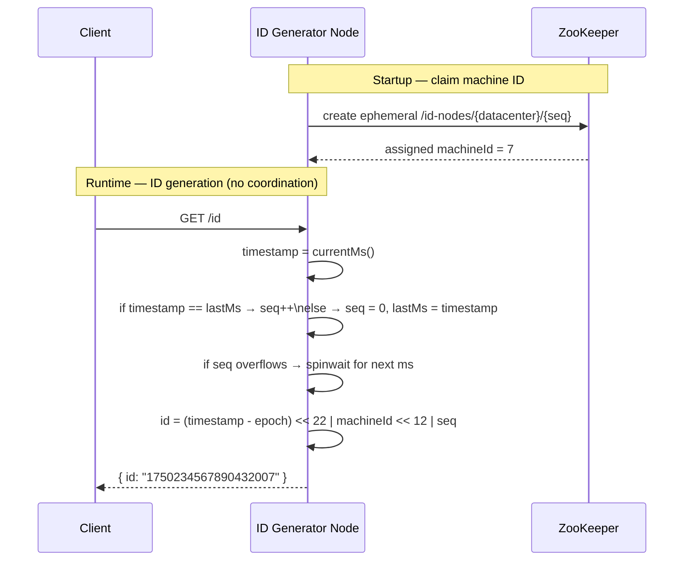

import Tldr from '../../components/content/Tldr.astro';
import Capacity from '../../components/content/Capacity.astro';
import Pitfall from '../../components/content/Pitfall.astro';
import Curveball from '../../components/content/Curveball.astro';
import TradeoffTable from '../../components/content/TradeoffTable.astro';
import Mermaid from '../../components/content/Mermaid.astro';
import Bookmark from '../../components/content/Bookmark.astro';
import RelatedQuestions from '../../components/content/RelatedQuestions.astro';

<Bookmark slug="distributed-unique-id-generator" title="Design a Distributed Unique ID Generator" />

<Tldr>
- **Snowflake layout**: 41-bit timestamp (ms) | 10-bit machine ID | 12-bit sequence = 64-bit integer, yielding 4096 IDs/ms/node and k-sortable ordering without any coordination
- **Auto-increment is disqualified**: it is a single point of failure, leaks row-count business metrics to observers, and cannot be sharded without a central coordinator
- **UUID v4 is disqualified for most primary-key use cases**: 128 bits, completely random byte ordering causes B-tree page splits and cache eviction on every insert
- **Clock skew**: when NTP rolls the clock backward, refuse to generate until `currentMs > lastTimestamp` — or extend the sequence space — rather than risk issuing duplicates
- **Epoch choice matters**: set your custom epoch to a recent date (e.g. 2020-01-01); 41 bits at 1 ms resolution gives ~69 years of headroom from that anchor
</Tldr>

## The problem with simple solutions

The most common knee-jerk answer to "how do you generate unique IDs?" is a database auto-increment column. It works beautifully on a single machine: the database engine serializes writes, the counter always advances, and every consumer gets a monotonically increasing integer. The problem appears the moment you need more than one database or more than one write path. If you shard your users table across four Postgres primaries, each with its own auto-increment sequence, you will get duplicate IDs. The classic fix — `SEQUENCE` with a step of four and different offsets per shard — works, but only as long as you never add or remove shards. Scaling the shard count requires a painful coordination step. Worse, auto-increment IDs are a silent business intelligence leak: a competitor who signs up for your service two weeks apart can subtract their user IDs and infer your registration rate.

UUID v4 solves the uniqueness problem without coordination, but introduces a different class of failure in write-heavy systems. A UUID v4 is 128 bits of cryptographically random data. Because the bytes are random, consecutive inserts scatter across the entire B-tree keyspace rather than appending to the rightmost leaf page. On a table with tens of millions of rows this causes constant page splits, destroys cache locality, and inflates index fragmentation. Benchmarks on production-sized datasets routinely show UUID v4 primary keys running 2–5x slower on write throughput than sequential keys. For URL tokens, session IDs, or trace IDs where you never do range scans, UUID v4 is completely fine. For a database primary key that joins to five other tables, it is a slow-motion disaster.

The engineering community converged on a purpose-built solution: embed a millisecond-precision timestamp into the high bits of the ID so that IDs generated close together sort close together in the B-tree, then use low-order bits for machine identity and a sequence counter to handle burst traffic within a single millisecond. Twitter's Snowflake, published in 2010, is the canonical design. Instagram, Discord, Sony, and dozens of other large-scale systems have adopted variations of it. The rest of this article derives the design from first principles and addresses the edge cases that trip up interview candidates.

## Clarifying questions

| Question | Ideal answer to establish | Why it shapes the design |
|---|---|---|
| Should the ID fit in a 64-bit integer, or is 128 bits acceptable? | 64-bit preferred for DB primary keys; 128 for globally distributed opaque tokens | Determines whether Snowflake layout is viable or UUID/ULID is better |
| Does insert order need to match time order? | Yes for most DB use cases (index locality); no for opaque tokens | Drives whether you need a time-prefix at all |
| What is the peak write rate across the entire cluster? | e.g. 500 K IDs/sec today, 2 M IDs/sec in 18 months | Determines minimum sequence bits and node count |
| Must IDs be unpredictable (security requirement)? | No for internal DB keys; yes for public-facing URL tokens | Snowflake IDs are not secret — timestamp and machine ID are recoverable |
| Is this deployment single-datacenter or multi-datacenter? | Multi-datacenter active-active | Requires datacenter bits in the machine ID field, reduces machine ID space per DC |
| What is the primary use case — DB primary key, URL shortener token, distributed trace ID? | Determines locality, sortability, and opacity requirements | A trace ID can be opaque; a FK join key must be compact |
| Does uniqueness need to be mathematically guaranteed, or is best-effort with collision probability 10⁻¹⁸ acceptable? | Guaranteed for primary keys; probabilistic acceptable for trace IDs | Opens door to UUIDv4 / ULID for trace IDs |
| Are there existing systems we must interoperate with (e.g. Cassandra TimeUUID, MongoDB ObjectId)? | Determines whether to adopt an existing format or define a new one | Adopting a standard saves integration work at the cost of layout flexibility |

## Functional requirements

- Generate globally unique IDs on demand with no central coordinator
- Each ID must fit in a 64-bit signed integer (compatible with most database engines and JSON without precision loss)
- IDs must be k-sortable: IDs generated within the same millisecond window may arrive in any order relative to each other, but IDs from different milliseconds must sort in wall-clock order
- IDs must be opaque enough that machine ID and timestamp are not immediately obvious from the raw integer without documentation
- The system must support horizontal scaling by adding new generator nodes without coordination beyond initial machine ID assignment

## Non-functional requirements

- **Throughput**: generate at least 1 million IDs per second globally across the cluster
- **Latency**: p99 generation latency under 1 ms (ID generation must never be on the critical path of a user-facing write)
- **Uniqueness**: zero collisions — a duplicate primary key is a data-integrity incident, not a metrics blip
- **Availability**: no single point of failure; the loss of any one ID generator node must not prevent clients from obtaining IDs (they fail over to another node)
- **Operability**: machine ID assignment must survive node restarts without manual intervention

## Capacity estimation

<Capacity>
**Sequence bits capacity per node**

$$2^{12} = 4{,}096 \text{ IDs per millisecond per node}$$

$$4{,}096 \times 1{,}000\text{ ms/s} = 4{,}096{,}000 \text{ IDs/sec per node}$$

**Cluster theoretical max (10-bit machine ID = 1024 nodes)**

$$4{,}096 \times 1{,}024 \times 1{,}000 \approx 4.2 \text{ billion IDs/sec}$$

**Practical deployment with 64 nodes**

$$4{,}096 \times 64 \times 1{,}000 = 262{,}144{,}000 \approx 262\text{ M IDs/sec}$$

This comfortably covers the 1 M IDs/sec target with a 262x safety margin at 64 nodes.

**Timestamp range**

$$2^{41} \text{ ms} = 2{,}199{,}023{,}255{,}552 \text{ ms} \approx 69.7 \text{ years}$$

With a 2020-01-01 epoch, the timestamp field wraps in approximately 2089.

**Storage**

Each ID is exactly 8 bytes. At 1 M IDs/sec, 1 year of IDs generated centrally (for audit purposes) consumes:

$$1{,}000{,}000 \times 86{,}400 \times 365 \times 8 \approx 252 \text{ TB}$$

In practice IDs are embedded in application records — there is no central ID store. Generation is stateless per node.
</Capacity>

## API design

ID generation intentionally has a minimal surface area. Complexity belongs in the implementation, not the contract.

```http
GET /id
```

Response:

```json
{
  "id": "1750234567890432001",
  "generatedAtMs": 1746662400123
}
```

For high-throughput clients that want to amortize HTTP overhead:

```http
GET /id/batch?count=500
```

Response:

```json
[1750234567890432001, 1750234567890432002, ...]
```

Constraints:
- `count` capped at 1000 per request to bound response size
- IDs returned as JSON strings when targeting JavaScript clients (64-bit integers exceed `Number.MAX_SAFE_INTEGER`)
- No authentication required if the endpoint is internal-only; add mTLS or a service mesh policy if exposed externally

## Data model

Snowflake encodes metadata directly into the bit layout of the integer. There is no backing table.

```
 63      62            22          17          12         0
  |       |             |           |           |         |
  0  [41-bit timestamp] [5-bit DC]  [5-bit node] [12-bit seq]
```

| Field | Bits | Max value | Purpose |
|---|---|---|---|
| Sign bit | 1 | 0 | Always zero; keeps the ID positive as a signed 64-bit integer |
| Timestamp | 41 | 2,199,023,255,551 | Milliseconds since custom epoch |
| Datacenter ID | 5 | 31 | Up to 32 datacenters |
| Machine ID | 5 | 31 | Up to 32 nodes per datacenter |
| Sequence | 12 | 4,095 | Monotonic counter, resets to 0 each millisecond |

The combined 10-bit machine field (datacenter + node) supports 1024 distinct generator nodes. Twitter's original Snowflake used this exact split. Discord uses a 10-bit worker ID without the datacenter subdivision (their DCs are treated as independent deployments). Instagram used a 13-bit shard ID embedded in Postgres sequences rather than a separate service entirely.

The key design insight is that the most significant bits carry the timestamp. When a database engine stores IDs in a B-tree, new IDs always land at the rightmost leaf because they are always larger than any previous ID (modulo within-millisecond sequencing). This is equivalent to a surrogate sequential key from an index-locality standpoint, without the coordination overhead of a global counter.

## High-level architecture

<Mermaid>

</Mermaid>

The critical observation is that after startup registration, each generator node operates entirely independently. There are no inter-node locks, no shared counters, and no cross-node communication. Uniqueness is guaranteed by the combination of wall-clock time and machine ID — two different nodes with different machine IDs cannot produce the same ID even if their clocks are perfectly synchronized. Two IDs from the same node in the same millisecond differ by their sequence number.

ZooKeeper handles machine ID assignment through ephemeral nodes. When an ID generator starts, it scans `/id-nodes/{datacenter}/` for the lowest unclaimed slot and creates an ephemeral node there. The node ID embedded in IDs it generates matches this slot number. If the generator process dies, ZooKeeper's session expiry (typically 30 seconds) causes the ephemeral node to disappear, releasing the machine ID for reuse. This means machine IDs can be reused — but not within the same millisecond window, because a new process cannot start, connect to ZooKeeper, and claim a machine ID in under one millisecond.

## Deep dives

### The Snowflake bit layout

The sign bit constraint is easy to overlook in an interview. Java's `long` and most SQL `BIGINT` types are signed. If bit 63 is set, the integer is negative, which breaks ordering assumptions and often breaks ORM-layer validation that rejects negative primary keys. Always force bit 63 to zero by ensuring `(timestamp - epoch) < 2^41`. With a 2020 epoch this holds until 2089.

The timestamp field uses millisecond resolution rather than microseconds or nanoseconds for a deliberate reason: `System.currentTimeMillis()` is reliable and cheap on every JVM and OS. Microsecond-resolution clocks (`System.nanoTime()`, `clock_gettime(CLOCK_REALTIME)`) have higher resolution but are not necessarily more accurate — they reflect the hardware counter, which may drift faster than NTP corrects. Using milliseconds also means the sequence field handles 4096 IDs per tick, which is sufficient for all but the most extreme single-node workloads.

The sequence field resets to zero at each new millisecond boundary. Within a millisecond, IDs from the same node are strictly monotonic. Across millisecond boundaries, IDs are monotonic in the timestamp component. This property — k-sortability — means that a `SELECT ... ORDER BY id` query returns rows in approximately time order even though it was never designed as a time-series table. Range scans like "give me all events in the last 5 minutes" can be expressed as `WHERE id BETWEEN snowflake_at(now-5m) AND snowflake_at(now)` without a separate timestamp column.

### Clock skew problem

NTP does not merely discipline a drifting clock — it can move the clock backward. When an NTP correction fires and the system clock jumps from `T+5` back to `T`, a naive ID generator will reuse timestamp values it has already issued. Combined with a machine ID that hasn't changed, this produces duplicate IDs. The consequences range from a duplicate-key error on insert (detectable, loud) to a silent collision in an eventually-consistent store that last-write-wins (silent data corruption).

There are three production-grade responses to backward clock motion:

**Strategy 1 — Wait it out (Twitter Snowflake's approach).** On detecting `currentMs < lastTimestamp`, spin until `currentMs >= lastTimestamp`. For corrections under a few milliseconds this is imperceptible. For corrections larger than a configurable threshold (Twitter used 10 ms), throw an exception and let the caller retry against a different node. This is the safest strategy because it never produces a duplicate — it only delays or redirects generation.

**Strategy 2 — Extend the sequence space.** On detecting clock rollback, continue incrementing the sequence counter beyond the normal per-millisecond boundary, treating the current millisecond as artificially extended. This avoids throwing exceptions at the cost of slightly higher sequence numbers. It only works if the rollback is small enough that the sequence doesn't overflow (4096 slots buys about 4 µs of headroom at sustained 1B IDs/sec per node, which is not much). For larger rollbacks this strategy degrades to strategy 1.

**Strategy 3 — Logical clocks.** Decouple the timestamp from wall-clock time entirely. Maintain a Lamport clock or hybrid logical clock (HLC) that only ever advances. Wall-clock time provides the initial seed and periodic anchoring, but the clock is never allowed to go backward. This is the approach used in CockroachDB and Spanner-style systems. It adds complexity and makes the embedded timestamp slightly less accurate as wall-clock time, but it is immune to NTP interference.

For a Snowflake-style ID generator under typical data center conditions (NTP corrections under 1 ms), strategy 1 is the right default. Its failure mode is a brief generation pause rather than data corruption.

### Machine ID assignment

The ZooKeeper approach described in the architecture section is robust but operationally heavyweight. There are three common alternatives:

**Hard-coded configuration.** Each node has `id.machine-id=7` in its deployment config. Simple, zero-dependency, works everywhere. The failure mode is a human misconfiguring two nodes with the same ID — which is rare in a well-run environment but catastrophic when it happens. Add a startup check that logs the machine ID prominently and alert on duplicate IDs in your observability pipeline.

**Kubernetes downward API + pod ordinal.** If you run ID generators as a `StatefulSet`, Kubernetes assigns a stable ordinal (0, 1, 2...) to each pod. Inject it via `MY_POD_NAME` or `MY_POD_ORDINAL` and parse the integer. This gives stable machine IDs across restarts without a ZooKeeper dependency, as long as you don't scale beyond 1023 replicas.

**Redis with TTL-based heartbeat.** The node acquires a Redis key `id-node:{dc}:{n}` with a 30-second TTL and refreshes it every 10 seconds. If the node dies, the key expires and another node can claim that ID. This is lighter than ZooKeeper but slightly less durable if Redis itself is unavailable during the refresh window.

For most organizations, hard-coded configuration with a startup uniqueness check and a CI lint rule that detects duplicate machine IDs across deployment manifests is the pragmatic sweet spot.

## Java integration

### Snowflake ID generator

```java
package dev.pushkar.idgen;

public final class SnowflakeIdGenerator {
    // Custom epoch: 2020-01-01T00:00:00Z in ms
    private static final long EPOCH = 1_577_836_800_000L;
    private static final int MACHINE_BITS  = 10;
    private static final int SEQUENCE_BITS = 12;
    private static final long MAX_MACHINE_ID  = (1L << MACHINE_BITS)  - 1; // 1023
    private static final long MAX_SEQUENCE     = (1L << SEQUENCE_BITS) - 1; // 4095
    private static final int  MACHINE_SHIFT    = SEQUENCE_BITS;             // 12
    private static final int  TIMESTAMP_SHIFT  = SEQUENCE_BITS + MACHINE_BITS; // 22

    private final long machineId;
    private long lastTimestamp = -1L;
    private long sequence      = 0L;

    public SnowflakeIdGenerator(long machineId) {
        if (machineId < 0 || machineId > MAX_MACHINE_ID)
            throw new IllegalArgumentException("machineId out of range: " + machineId);
        this.machineId = machineId;
    }

    public synchronized long nextId() {
        long now = System.currentTimeMillis();
        if (now < lastTimestamp) {
            // Clock moved backwards — wait it out rather than risk duplicates
            long skew = lastTimestamp - now;
            if (skew > 5) throw new ClockSkewException(skew);
            now = lastTimestamp; // will cause sequence overflow + spinwait below
        }
        if (now == lastTimestamp) {
            sequence = (sequence + 1) & MAX_SEQUENCE;
            if (sequence == 0) now = waitNextMs(lastTimestamp); // sequence exhausted
        } else {
            sequence = 0L;
        }
        lastTimestamp = now;
        return ((now - EPOCH) << TIMESTAMP_SHIFT)
             | (machineId       << MACHINE_SHIFT)
             | sequence;
    }

    private long waitNextMs(long lastMs) {
        long ts = System.currentTimeMillis();
        while (ts <= lastMs) ts = System.currentTimeMillis();
        return ts;
    }

    public static long extractTimestamp(long id) {
        return (id >> TIMESTAMP_SHIFT) + EPOCH;
    }
}
```

A few implementation details worth calling out explicitly in an interview:

- `synchronized` on `nextId()` is intentional. The instance is shared across threads within a single JVM process. The `synchronized` block is micro-seconds wide — just arithmetic and a System call — so lock contention is negligible even at 100 K calls/sec per node. If you need lock-free generation, run one `SnowflakeIdGenerator` instance per thread (partition the machine ID bits across threads) rather than using `AtomicLong` tricks that are harder to reason about.
- `& MAX_SEQUENCE` is a branchless bitmask wrap-around. When `sequence` reaches 4096, the mask resets it to zero, and the subsequent `if (sequence == 0)` check triggers the spinwait.
- The `ClockSkewException` on skew greater than 5 ms is a deliberate fail-fast. Callers should catch it and route the request to a different ID generator node. A 5 ms threshold is generous for typical NTP corrections and conservative relative to the 69-year timestamp range.

### Spring Boot REST service

```java
@RestController
@RequestMapping("/id")
public class IdController {
    private final SnowflakeIdGenerator generator;

    public IdController(@Value("${id.machine-id}") long machineId) {
        this.generator = new SnowflakeIdGenerator(machineId);
    }

    @GetMapping
    public IdResponse generate() {
        long id = generator.nextId();
        return new IdResponse(id, SnowflakeIdGenerator.extractTimestamp(id));
    }

    @GetMapping("/batch")
    public List<Long> batch(@RequestParam(defaultValue = "100") int count) {
        if (count > 1000) throw new ResponseStatusException(HttpStatus.BAD_REQUEST);
        return LongStream.range(0, count)
            .mapToObj(_ -> generator.nextId())
            .toList();
    }

    record IdResponse(long id, long generatedAtMs) {}
}
```

Wire `id.machine-id` from your Kubernetes `StatefulSet` ordinal or Vault-injected secret. The batch endpoint lets high-throughput producers (e.g. an event ingestion pipeline) reduce HTTP overhead by fetching 500 IDs per round trip instead of one. The 1000-ID cap prevents a single client from hogging the generator for multi-millisecond stretches, which would force other callers to wait behind the `synchronized` lock.

For production, add:
- A `/health` liveness probe that calls `generator.nextId()` and discards the result — confirms the generator clock is not stuck
- Micrometer metrics: `id.generation.count`, `id.generation.skew_ms` (when clock skew is detected)
- A startup log line that prints the resolved machine ID and the epoch offset — essential for debugging ID collisions

<TradeoffTable
  rows={[
    {
      strategy: "Auto-increment (DB sequence)",
      uniqueness: "Guaranteed",
      sortable: "Yes — strictly monotonic",
      scale: "Single node / shard",
      dbFriendly: "Excellent — sequential inserts"
    },
    {
      strategy: "UUID v4",
      uniqueness: "Guaranteed (collision probability ~10⁻³⁶)",
      sortable: "No — random",
      scale: "Fully distributed",
      dbFriendly: "Poor — B-tree fragmentation"
    },
    {
      strategy: "UUID v7",
      uniqueness: "Guaranteed",
      sortable: "Yes — time-based prefix",
      scale: "Fully distributed",
      dbFriendly: "Good — mostly sequential"
    },
    {
      strategy: "Snowflake (64-bit)",
      uniqueness: "Guaranteed",
      sortable: "k-sortable (ms granularity)",
      scale: "Up to 1024 nodes",
      dbFriendly: "Excellent — sequential inserts"
    },
    {
      strategy: "ULID",
      uniqueness: "Guaranteed",
      sortable: "Yes — lexicographically",
      scale: "Fully distributed",
      dbFriendly: "Good — 128-bit overhead"
    }
  ]}
  columns={["Strategy", "Uniqueness", "Sortable", "Scale", "DB friendly"]}
/>

<Pitfall>
**Not accounting for clock skew.** NTP corrections happen silently and can move the system clock backward by milliseconds to tens of milliseconds. A generator that blindly uses `System.currentTimeMillis()` without comparing to `lastTimestamp` will reissue timestamp values it has already used. Combined with an unchanged machine ID, this produces duplicate IDs. The fix is a single comparison on every call: if `now < lastTimestamp`, either wait or throw — never proceed with a stale timestamp.
</Pitfall>

<Pitfall>
**Using timestamp in seconds instead of milliseconds.** With second-resolution timestamps, the sequence field must absorb all IDs generated within a 1-second window. At 4096 IDs/ms capacity you can sustain 4096 IDs/sec — but the moment you generate the 4097th ID in the same second you must spinwait until the next second boundary. That is a 999 ms stall. One typo (`System.currentTimeMillis() / 1000` instead of `System.currentTimeMillis()`) turns a system designed for millions of IDs/sec into one that falls apart under modest load.
</Pitfall>

<Curveball>
**"Your Snowflake node has been down for 10 minutes. When it comes back online, clocks are synchronized. What's the first ID it generates, and is there any gap risk?"**

When the node restarts, `lastTimestamp` is initialized to `-1L` (or read from durable storage if you persist it). The current wall-clock time is 10 minutes later than when the node crashed. The first call to `nextId()` sets `lastTimestamp = now` and `sequence = 0`, then produces a valid ID with a timestamp 10 minutes after the last ID that node issued. There is no gap risk from the ID-uniqueness perspective — the timestamp field simply advances. There is a cosmetic gap in the sequence of IDs from that node (none were issued for 10 minutes), but IDs from other nodes were issued continuously, so the global ID stream has no gap. The key follow-up question: if you persist `lastTimestamp` to disk on graceful shutdown, the node can verify on startup that the clock has advanced sufficiently, providing an extra safety check against time-travel bugs from snapshot restores.
</Curveball>

<Curveball>
**"You need to shard a users table by ID. A Snowflake ID in the shard key means new rows always land on the same hot shard for ~1 ms. How do you fix this?"**

This is the monotonic key hot-partition problem. Because the timestamp occupies the high bits, all IDs generated in the current millisecond share the same high-bit prefix, which routes them to the same shard if your sharding function is `id % N`. Two mitigations:

1. **Shard by a derived attribute**, not the ID itself. Shard by `user_id % N` (where `user_id` is a Snowflake ID) rather than `id % N` for unrelated tables. The writes are still hot on the user table but scattered across shards for writes that reference the user.

2. **Bit-shuffle the Snowflake ID for shard routing.** XOR the ID with a per-deployment salt or reverse the bit order before computing `id % N`. The stored ID is unchanged; the sharding function just uses a shuffled version. This distributes current-millisecond IDs across shards while preserving sortability in the stored value.

For new designs, consider putting the machine ID or sequence bits in the most significant position for sharding purposes (not storage) — a technique called ID smearing. CockroachDB uses a similar trick internally.
</Curveball>

<Curveball>
**"Two ID generator nodes have the same machineId due to a ZooKeeper split-brain. How many duplicate IDs could be generated, and how do you detect it?"**

During the split-brain window both nodes believe they own machine ID `N`. Every ID they generate has the same machine ID field. Two IDs generated in the same millisecond with the same sequence number are identical. In the worst case — both nodes running at full 4096 IDs/ms throughput with synchronized clocks — they generate 4096 duplicate IDs per millisecond, or roughly **4 million duplicates per second** for as long as the split-brain persists.

Detection strategies:
- **Deduplication at write time**: database unique constraints or Cassandra lightweight transactions on the primary key will surface collisions as write errors. Monitor the rate of duplicate-key errors — a spike indicates a machine ID collision.
- **ID audit log**: emit every generated ID to a Kafka topic with node metadata. A downstream consumer checks for duplicates across the stream. With Kafka's exactly-once semantics you can detect collisions within seconds.
- **Heartbeat uniqueness check**: each node periodically writes a record `{machine_id, timestamp, node_hostname}` to a shared store. A monitoring job alerts if two different hostnames claim the same machine ID.

Prevention is better: configure ZooKeeper with a quorum fence (STONITH equivalent) so that a node that cannot reach ZooKeeper stops generating IDs rather than continuing independently. Make the machine ID registration TTL shorter than the minimum restart time so that a crashed node's ID is released before a replacement can claim it.
</Curveball>

<RelatedQuestions items={[
  { slug: "consistent-hashing", title: "Design a Consistent Hashing & Sharding Service", difficulty: "senior" },
  { slug: "distributed-locking-service", title: "Design a Distributed Locking Service", difficulty: "staff" },
  { slug: "distributed-kv-store", title: "Design a Distributed KV Store", difficulty: "staff" },
]} />

## Further reading

- **Twitter Snowflake** (original blog post, 2010) — the source of the canonical 64-bit layout; still the clearest motivation document for the design
- **Instagram Engineering: Sharding & IDs at Instagram** — shows how to embed Snowflake-style IDs into Postgres sequences using PL/pgSQL, avoiding a separate ID service entirely
- **Discord: How Discord Stores Billions of Messages** — covers their Snowflake variant and the practical consequences of k-sortable IDs on Cassandra compaction
- **ULID specification** (github.com/ulid/spec) — a 128-bit lexicographically sortable alternative that encodes time in the high 48 bits and uses Crockford Base32 for human readability
- **UUID v7 (RFC 9562)** — the IETF-standardized time-ordered UUID; if your environment already uses UUID infrastructure, upgrading to v7 gets you sortability without a custom service
- **Hybrid Logical Clocks (HLC)** — Kulkarni et al., 2014 — the theoretical foundation for clocks that are both causally consistent and close to wall-clock time; used in CockroachDB and YugabyteDB
- **Lamport Timestamps** — Leslie Lamport, 1978 — the original logical clock paper; understanding it makes HLC and vector clocks significantly easier to reason about
