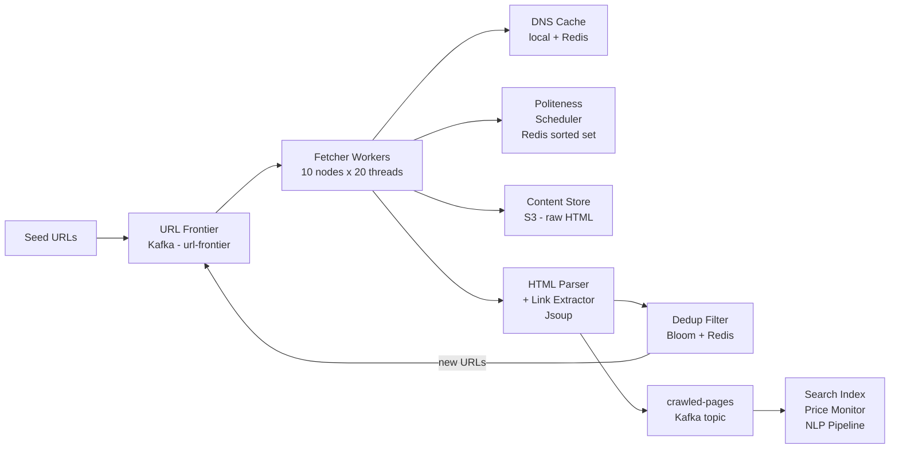

import Tldr from '../../components/content/Tldr.astro';
import Capacity from '../../components/content/Capacity.astro';
import Pitfall from '../../components/content/Pitfall.astro';
import Curveball from '../../components/content/Curveball.astro';
import TradeoffTable from '../../components/content/TradeoffTable.astro';
import Mermaid from '../../components/content/Mermaid.astro';
import Bookmark from '../../components/content/Bookmark.astro';
import RelatedQuestions from '../../components/content/RelatedQuestions.astro';

<Bookmark slug="web-crawler" title="Design a Web Crawler" />

<Tldr>
- **BFS is the correct traversal strategy** (not DFS) — it naturally discovers high-PageRank pages first since popular pages have many inbound links; DFS risks sinking deep into one corner of the web before surfacing anything useful
- **Politeness is mandatory**: obey `robots.txt`, enforce per-domain crawl delay (1 req/sec default), rotate `User-Agent`, and handle `429` responses with exponential backoff — ignoring politeness gets your IP banned and creates legal exposure
- **URL deduplication**: Bloom filter (0.1% false positive rate, zero false negatives) in front of a Redis hash store — never enqueue a URL that has already been seen
- **Recrawl scheduling**: use a priority queue weighted by page change frequency — news sites need recrawls every few hours; static documentation pages can wait weeks
- **Trap detection**: detect infinite URL spaces (session IDs, calendar links that extend arbitrarily into the future) via URL normalization and max-depth limits — without these your frontier grows without bound
</Tldr>

## Why crawling is hard

The open web is not a tidy, well-labeled dataset. It is a chaotic graph of approximately 60 billion pages (Google's estimated index as of 2024), growing by millions of pages daily, where every node can link to every other node, including back to itself. A naive depth-first traversal from a handful of seed URLs will wander into Wikipedia's link graph and never emerge. A naive breadth-first traversal without deduplication will enqueue the same popular URL tens of thousands of times — Reddit's front page is linked from every corner of the internet. Crawling at scale means solving graph traversal, distributed systems coordination, legal compliance, and adversarial content problems simultaneously.

Politeness is the constraint that makes crawling genuinely difficult from an engineering standpoint. A crawler that fires requests as fast as it can is a distributed denial-of-service attack. Every domain you crawl is hosted by someone who has provisioned their infrastructure for actual users, not for your crawler hammering `/sitemap.xml` five thousand times a second. The Crawlers must respect `robots.txt` exclusion rules, honor `Crawl-delay` directives, back off gracefully when they receive `429 Too Many Requests` or `503 Service Unavailable`, and cap their per-domain request rate even when the target server does not explicitly ask them to. This is both an ethical requirement and a practical one — websites that detect aggressive crawlers block the crawler's IP, rendering all future crawl attempts against that domain useless.

Freshness adds a third dimension of complexity. A page crawled today may be different tomorrow. A news homepage is stale within minutes. A company's "About Us" page might be stable for years. A crawler that recrawls everything on the same schedule wastes enormous resources on static content while failing to keep news content current. A production crawl system must maintain per-domain, and ideally per-page, change frequency estimates and schedule recrawls proportionally. This is a scheduling and prediction problem layered on top of the core crawling machinery.

## Clarifying questions

Before drawing boxes and arrows, surface the constraints that collapse the design space. Different answers lead to fundamentally different architectures.

| Question | Ideal answer to probe for | Why it changes the design |
|---|---|---|
| What are we crawling for? | Search index, price monitoring, academic research, competitive intelligence | Determines freshness SLA, content types needed, and legal constraints |
| Target scale — how many pages, how fresh? | 1B pages/month, top 10M pages recrawled within 24h | Drives throughput math, storage sizing, and frontier queue depth |
| Do we obey `robots.txt`? | Yes — always for a general-purpose crawler | Determines if you need a per-domain `robots.txt` cache and parser |
| Are we crawling the whole web or a curated domain set? | Whole web starts from seeds; curated domain set allows domain-scoped frontier | Whole-web requires aggressive dedup; domain-scoped simplifies frontier management dramatically |
| What content types? | HTML only, or also PDFs, images, JavaScript bundles | PDFs require different parsing; JavaScript-rendered pages require a headless browser (Playwright/Puppeteer), which is 10–100× more expensive per page than static HTML fetches |
| How do we handle JavaScript-rendered pages? | Headless Chrome for JS-heavy pages, static fetch for the rest | Headless rendering adds per-page latency of 2–5 seconds versus 50–200 ms for static; changes cluster sizing substantially |
| What do we do with crawled content? | Store raw HTML in object storage; emit parsed text + metadata to a search index via Kafka | Determines storage tier, serialization format, and downstream consumer design |
| Legal and ethical constraints? | Comply with `robots.txt`, respect `noindex` meta tags, honor `Crawl-delay`, do not crawl authenticated pages without permission | Shapes politeness enforcement, what metadata you persist, and whether you need per-domain opt-out handling |

## Functional requirements

- Accept seed URLs and discover new URLs by following links in crawled pages
- Fetch and store raw HTML (and optionally PDFs, images) for every crawled URL
- Extract and canonicalize outbound links from each crawled page; enqueue new URLs for crawling
- Respect `robots.txt` per domain — parse `Disallow` rules, honor `Crawl-delay`, and skip disallowed paths
- Deduplicate URLs so each canonical URL is crawled at most once per recrawl interval
- Schedule recrawls based on estimated page change frequency
- Emit a structured event per crawled page to a downstream Kafka topic for indexing consumers
- Expose `submitSeed(url)`, `getCrawlStatus(url)`, and `getPage(url)` as internal APIs

## Non-functional requirements

- **Throughput**: crawl 1 billion pages per month (~385 pages/sec sustained)
- **Freshness SLA**: the top 10 million pages (by PageRank estimate) must be recrawled within 24 hours of any content change
- **Politeness**: no more than 1 request per second per domain by default; honor `Crawl-delay` overrides from `robots.txt`
- **Storage**: retain raw HTML for 3 months; keep URL metadata (status, last crawled timestamp, change frequency) indefinitely
- **Deduplication accuracy**: Bloom filter false positive rate ≤ 0.1% — a false positive skips a URL that should have been crawled, which is acceptable; false negatives (crawling a URL already seen) would inflate the frontier and storage
- **Availability**: crawl workers are stateless and horizontally scalable; frontier queue (Kafka) is the durable component
- **Observability**: per-domain crawl rate, frontier queue depth, fetch error rate, and Bloom filter hit rate exposed via Prometheus metrics

## Capacity estimation

<Capacity title="Web crawler sizing">

**Crawl throughput**

$$
\text{pages/sec} = \frac{1{,}000{,}000{,}000}{30 \times 24 \times 3600} \approx 385 \; \text{pages/sec}
$$

With 20 fetcher workers per machine and each fetch averaging 500 ms (including DNS, TCP, TLS, response body):

$$
\text{concurrency per machine} = 20 \; \text{workers}
$$
$$
\text{throughput per machine} = \frac{20}{0.5\text{ s}} = 40 \; \text{pages/sec}
$$
$$
\text{machines needed} = \lceil 385 / 40 \rceil = 10 \; \text{fetcher nodes}
$$

**Raw HTML storage**

Average page size 100 KB (compressed ~30 KB with gzip):

$$
\text{monthly raw storage} = 1{,}000{,}000{,}000 \times 100 \; \text{KB} = 100 \; \text{TB/month}
$$

At 3-month retention: 300 TB. On S3 Standard at $0.023/GB this is ~$6,900/month — or $2,300/month on S3 Intelligent-Tiering once access patterns stabilize.

**URL frontier storage**

10 billion unique URLs at ~100 bytes each (URL string + metadata):

$$
\text{URL store} = 10 \times 10^9 \times 100 \; \text{bytes} = 1 \; \text{TB}
$$

Stored in a persistent key-value store (Cassandra or DynamoDB) rather than RAM. The active frontier (URLs queued for imminent crawling) lives in Kafka partitions — manageable at a fraction of total URL space.

**Bloom filter sizing**

For 10 billion URLs with a 0.1% false positive rate, using the standard formula:

$$
m = -\frac{n \ln p}{(\ln 2)^2} = -\frac{10^{10} \times \ln(0.001)}{(\ln 2)^2} \approx 143.6 \; \text{billion bits} \approx 17.9 \; \text{GB RAM}
$$

Optimal number of hash functions:

$$
k = -\frac{\ln p}{\ln 2} \approx 10 \; \text{hash functions}
$$

A 20 GB Redis node comfortably holds the Bloom filter with headroom. One node per datacenter, replicated for HA.

**Bandwidth**

$$
\text{sustained download} = 385 \; \text{req/sec} \times 100 \; \text{KB} = 38.5 \; \text{MB/s} \approx 308 \; \text{Mbps}
$$

A single 10 GbE NIC has 10 Gbps capacity — bandwidth is not the bottleneck; per-domain rate limiting and DNS resolution are.

</Capacity>

## API design

**Internal APIs (crawler control plane)**

```
POST /seeds
  Body: { "url": "https://example.com" }
  Response: { "jobId": "uuid", "status": "queued" }
  Effect: Validates URL, deduplicates, enqueues to Kafka url-frontier topic.

GET /status?url=<encoded-url>
  Response: { "url": "...", "lastCrawledAt": "ISO8601", "status": "crawled|pending|error|blocked" }
  Effect: Looks up URL hash in the URL metadata store.

GET /page?url=<encoded-url>
  Response: { "url": "...", "fetchedAt": "ISO8601", "contentType": "text/html",
              "storageUri": "s3://crawl-raw/2026/05/07/<sha256>.gz" }
  Effect: Returns presigned S3 URL for raw HTML; does not stream content through the API tier.
```

**External (consumer-facing)**

Downstream consumers (search indexers, price monitors, NLP pipelines) subscribe to a Kafka topic rather than polling the crawl API. This decouples crawl throughput from consumer processing speed:

```
Kafka topic: crawled-pages
Key:         url_hash (string, hex SHA-256)
Value schema (Avro):
  {
    "url":          string,
    "domain":       string,
    "fetchedAt":    long (epoch ms),
    "statusCode":   int,
    "contentType":  string,
    "storageUri":   string,    // s3:// URI for raw content
    "contentHash":  string,    // SHA-256 of raw body, for content dedup
    "outboundLinks": [string]  // extracted, normalized URLs
  }
```

Consumers can also request webhook delivery on a per-domain basis for real-time integration (e.g., a price monitoring service that wants to be notified the instant a product page is recrawled).

## Data model

**URL metadata table** (Cassandra — wide-column, write-optimized, partition by domain for locality)

```
url_hash        TEXT    PRIMARY KEY    -- SHA-256 of normalized URL
url             TEXT                   -- canonical URL string
domain          TEXT                   -- extracted hostname
last_crawled_at TIMESTAMP              -- wall clock of last successful fetch
crawl_frequency INTERVAL               -- estimated recrawl interval (e.g., 6h, 7d)
page_rank_est   DOUBLE                 -- estimated importance score for priority queue
status          TEXT                   -- 'pending' | 'crawled' | 'error' | 'blocked'
http_status     INT                    -- last HTTP status code
content_hash    TEXT                   -- SHA-256 of last fetched body (for change detection)
depth           INT                    -- hops from the nearest seed URL
```

**Page content** — stored in S3/GCS at `s3://crawl-raw/<year>/<month>/<day>/<url_hash>.gz`. The URL metadata table holds the storage URI rather than the content itself. Raw HTML is gzip-compressed before upload; average object size drops from 100 KB to ~30 KB. Object lifecycle policies automatically expire content older than 90 days.

**Robots.txt cache** (Redis, TTL-driven)

```
Key:   robots:<domain>                -- e.g., robots:example.com
Value: {
  "rules":     [{ "userAgent": "*", "disallow": ["/private/"], "crawlDelay": 2 }],
  "fetchedAt": epoch_ms,
  "ttl":       86400                  -- 24h default; use Crawl-delay if specified
}
```

**Domain crawl state** (Redis sorted set for the politeness scheduler)

```
Key:   domain-next-crawl-time         -- sorted set, score = nextAllowedEpochMs
Member: domain string                 -- e.g., "example.com"
```

## High-level architecture

<Mermaid>

</Mermaid>

The architecture is deliberately pipeline-shaped. Every stage is stateless except for the shared coordination stores (Kafka, Redis, Cassandra). Fetcher workers pull URLs from the `url-frontier` Kafka topic, check the politeness scheduler before firing the request, write raw HTML to S3, pass the document to the HTML parser, and acknowledge the Kafka message. The parser extracts links and hands them to the dedup filter, which keeps new URLs out of the frontier if they have already been seen. The crawled page metadata is emitted to the `crawled-pages` topic for downstream consumers to do whatever they need — indexing, price extraction, entity recognition.

Kafka provides the durability layer for the frontier. If a fetcher node crashes mid-crawl, the Kafka consumer group rebalances and another worker picks up the unacknowledged URL. Kafka's log compaction on the `url-frontier` topic prevents the frontier from growing unboundedly — keys (URL hashes) are deduplicated by Kafka itself at the storage level, so even if a URL is enqueued multiple times before the Bloom filter catches it, only the most recent record survives compaction.

## Deep dives

### URL frontier and prioritization

The URL frontier is not just a queue — it is a priority scheduling system. Not all URLs are equal. A link to the New York Times homepage is worth crawling before a link to page 47 of a forum thread from 2009. The frontier must reflect this.

The two-tier priority design separates freshness scheduling from discovery:

**Tier 1 — High-priority queue**: URLs with a PageRank estimate above a threshold, or URLs for domains flagged as high-change-frequency (major news sites, e-commerce product pages, social feeds). These are published to a dedicated Kafka partition subset with higher consumer priority. Workers polling this tier get a thread pool allocation proportional to its expected throughput share.

**Tier 2 — Low-priority queue**: Everything else — newly discovered URLs with no PageRank estimate, deep-crawl pages, low-traffic domains. Workers drain this queue when Tier 1 is quiet.

Within each tier, a per-worker in-memory min-heap orders URLs by `nextCrawlTime`. Workers batch-pull 100 URLs from Kafka, insert them into the heap, and process them in `nextCrawlTime` order. This local sort removes the need for a globally sorted frontier (which would be a single-writer bottleneck at scale) and amortizes Kafka poll overhead.

**PageRank as a priority signal**: For a new URL with no crawl history, the priority signal is the number of distinct domains linking to it (approximated by how many pages in the last crawl batch contained this URL as an outbound link). A URL seen as a link in 1,000 distinct pages gets Tier 1 treatment on first crawl. After the first crawl, priority is recalculated based on observed change frequency.

### Politeness scheduler

The politeness scheduler enforces per-domain crawl rate limits before any HTTP request is issued. It is the firewall between your crawl throughput ambitions and the server operator's infrastructure capacity.

The core data structure is a Redis sorted set keyed `domain-next-crawl-time`, where the score for each domain member is the Unix timestamp (milliseconds) at which the next request to that domain is permitted. A fetcher worker acquiring a URL for domain `example.com` runs the following atomic Lua script:

```lua
local domain = KEYS[1]
local now     = tonumber(ARGV[1])
local delay   = tonumber(ARGV[2])   -- crawl delay in ms, from robots.txt or default 1000

local next = tonumber(redis.call('ZSCORE', 'domain-next-crawl-time', domain))
if next and next > now then
  return next   -- not yet — caller must wait or requeue
end
redis.call('ZADD', 'domain-next-crawl-time', now + delay, domain)
return 0        -- slot acquired — proceed with fetch
```

When the script returns a future timestamp, the fetcher does not sleep — it requeues the URL with a `notBefore` annotation and moves to the next URL in its local heap. This keeps the worker thread busy without holding a lock or blocking a thread on a `Thread.sleep`.

`robots.txt` parsing and caching happens on first contact with a new domain, or when the cached rules expire (24h default). The crawl delay from `robots.txt` (`Crawl-delay: 5` means 5 seconds between requests) overrides the 1 req/sec default. The `robots.txt` fetch is itself subject to politeness — a cold-start against a new domain begins with fetching `robots.txt` before the first content request.

`429 Too Many Requests` responses trigger exponential backoff: the domain's `nextCrawlTime` is set to `now + min(base_delay * 2^attempt, max_delay)` where `base_delay` starts at 60 seconds and `max_delay` caps at 24 hours. After 5 consecutive 429s, the domain is flagged as `throttled` in the URL metadata store and moved to the lowest-priority tier until the backoff window expires.

### Deduplication

Deduplication operates at three layers, each catching different classes of duplicates:

**Layer 1 — URL normalization** (no storage required): Before any lookup, every URL is normalized to its canonical form. Normalization includes: lowercasing the scheme and hostname; stripping URL fragments (`#anchor`); removing well-known tracking parameters (`utm_source`, `utm_medium`, `fbclid`, `gclid`, `sessionid`, `PHPSESSID`); sorting query parameters alphabetically; resolving `../` and `./` path segments; and appending a trailing slash to root paths. A URL that arrives as `https://Example.com/page?b=2&a=1&utm_source=google#section` becomes `https://example.com/page?a=1&b=2`. This alone eliminates a large fraction of apparent duplicates.

**Layer 2 — Bloom filter** (fast RAM lookup, ~18 GB): The Bloom filter answers the question "has this normalized URL hash been seen before?" with zero false negatives. A false positive (the Bloom filter says "seen" when the URL is actually new) results in skipping a URL — acceptable at a 0.1% rate. The filter is initialized on startup by streaming all URL hashes from the Cassandra URL table. New URLs are inserted into the filter as they are enqueued. The filter is sharded across workers by URL hash range so each worker maintains a local shard; cross-shard lookups go to a Redis Bloom filter (using RedisBloom / Bloom-in-Redis Bit operations) as the authoritative shared store.

**Layer 3 — Exact hash set in Redis**: On a Bloom filter miss (the URL might be new), perform an exact lookup in a Redis set: `SISMEMBER seen-urls <url_sha256>`. On confirmed new URL: `SADD seen-urls <url_sha256>` and enqueue. This two-step prevents the Bloom filter's false positives from causing real URLs to be silently dropped by adding an exact confirmation layer that has no false positives.

**Content deduplication** (detecting near-duplicate pages): Many domains serve the same content at multiple URLs (printer-friendly versions, mobile variants, pagination variants). SimHash computes a 64-bit fingerprint of page content using the XOR of hashed shingles. Two pages whose SimHash fingerprints differ by fewer than 3 bits (Hamming distance < 3) are considered near-duplicates. Only one is indexed. SimHash computation runs in the parser stage and is stored in the URL metadata table under `content_simhash`.

### Recrawl scheduling

A crawl system that fetches each page once is an archiver, not a crawler. A live search engine must continuously re-crawl the web to detect changes. The challenge is doing this proportionally — spending recrawl budget on pages that actually change, not on stable content.

**Strategy 1 — Fixed interval by content type**: The simplest approach assigns a recrawl interval by heuristic:
- News homepages: 15 minutes
- News article pages: 4 hours (content rarely changes after publish)
- E-commerce product pages: 6 hours
- Corporate "About" pages: 30 days
- `robots.txt`: 24 hours

This works for a domain-scoped crawler with well-understood content categories but does not adapt to actual observed change rates.

**Strategy 2 — Adaptive scheduling (exponential smoothing of change frequency)**: On every recrawl, compare the new content hash to the previously stored hash. If they differ, a change was detected. Track the inter-change interval using exponential smoothing:

$$
\hat{\lambda}_{t+1} = \alpha \cdot \lambda_t + (1 - \alpha) \cdot \hat{\lambda}_t
$$

where $\lambda_t$ is the observed inter-change duration at crawl $t$, $\alpha = 0.3$ is the smoothing factor, and $\hat{\lambda}$ is the smoothed estimate. The next crawl is scheduled at `lastCrawledAt + hat_lambda`. Pages that change rarely get progressively longer intervals; pages that change frequently converge to frequent recrawling automatically.

**Priority queue for freshness SLA**: To guarantee the top 10M pages are recrawled within 24 hours, maintain a separate high-priority Kafka topic for freshness-SLA URLs. A scheduler process runs continuously, pulling URLs whose `lastCrawledAt + recrawl_interval < now` from the Cassandra URL table and emitting them to the high-priority frontier topic. The scheduler is partitioned by domain to avoid hot partitions.

## Java integration

### Part A — Crawler worker

```java
package dev.pushkar.crawler;

import org.jsoup.Jsoup;
import org.jsoup.nodes.Document;
import com.google.common.hash.BloomFilter;
import com.google.common.hash.Funnels;
import java.nio.charset.StandardCharsets;
import java.net.URI;
import java.util.Set;
import java.util.stream.Collectors;

public final class CrawlWorker {
    private final BloomFilter<String> seenUrls;
    private final UrlFrontier frontier;
    private final ContentStore store;
    private final PolitenessScheduler politeness;

    public CrawlWorker(UrlFrontier frontier, ContentStore store, PolitenessScheduler politeness) {
        this.seenUrls = BloomFilter.create(
            Funnels.stringFunnel(StandardCharsets.UTF_8),
            10_000_000_000L,  // 10B expected URLs
            0.001             // 0.1% FPR
        );
        this.frontier  = frontier;
        this.store     = store;
        this.politeness = politeness;
    }

    public void crawl(String url) throws Exception {
        if (seenUrls.mightContain(url)) return; // Bloom filter fast-path
        seenUrls.put(url);

        String domain = URI.create(url).getHost();
        politeness.awaitCrawlSlot(domain); // blocks until polite to crawl

        Document doc = Jsoup.connect(url)
            .userAgent("PushkarBot/1.0 (+https://pushkar.dev/bot)")
            .timeout(10_000)
            .get();

        store.save(url, doc.html());

        Set<String> links = doc.select("a[href]").stream()
            .map(a -> a.absUrl("href"))
            .filter(this::isEligible)
            .collect(Collectors.toSet());

        links.forEach(frontier::enqueue);
    }

    private boolean isEligible(String url) {
        if (url.isBlank()) return false;
        if (!url.startsWith("http")) return false;
        // Reject known traps: session IDs, infinite date calendars
        if (url.contains("sessionid=") || url.contains("PHPSESSID=")) return false;
        return url.length() < 2048;
    }
}
```

The `BloomFilter.create` call with `10_000_000_000L` and `0.001` instructs Guava to size the underlying bit array automatically — it computes the optimal bit count and number of hash functions. In production this filter lives in a single JVM process per fetcher node, which is sufficient given that the Bloom filter is also mirrored to a shared Redis instance (RedisBloom) for cross-node lookups. The `isEligible` trap detection is deliberately simple here — production variants add regex-based pattern matching for known spider trap signatures (repetitive path segments, calendar date sequences, query-string depth explosion).

### Part B — Spring Boot Kafka-driven crawler

```java
package dev.pushkar.crawler;

import org.springframework.kafka.annotation.KafkaListener;
import org.springframework.kafka.support.Acknowledgment;
import org.springframework.stereotype.Component;
import org.springframework.stereotype.Service;
import com.github.benmanes.caffeine.cache.Cache;
import com.github.benmanes.caffeine.cache.Caffeine;

@Component
public class CrawlConsumer {
    private final CrawlWorker worker;

    public CrawlConsumer(CrawlWorker worker) {
        this.worker = worker;
    }

    @KafkaListener(
        topics    = "url-frontier",
        groupId   = "crawler-workers",
        concurrency = "20"
    )
    public void onUrl(String url, Acknowledgment ack) {
        try {
            worker.crawl(url);
            ack.acknowledge();
        } catch (Exception e) {
            // Negative-ack causes Kafka to redeliver after backoff
            log.warn("Failed to crawl {}: {}", url, e.getMessage());
        }
    }
}

@Service
public class PolitenessScheduler {

    // Per-domain: earliest time (epoch ms) the next request is allowed
    private final Cache<String, Long> nextSlot = Caffeine.newBuilder()
        .maximumSize(100_000)
        .build();

    public void awaitCrawlSlot(String domain) throws InterruptedException {
        long now  = System.currentTimeMillis();
        Long next = nextSlot.getIfPresent(domain);
        if (next != null && next > now) {
            Thread.sleep(next - now);
        }
        nextSlot.put(domain, System.currentTimeMillis() + 1_000); // 1 req/sec
    }
}
```

A few design decisions worth calling out explicitly in an interview. The `concurrency = "20"` annotation on `@KafkaListener` creates 20 consumer threads per application instance, matching the 20-worker assumption in the capacity estimation. The `ack.acknowledge()` call is manual — the `enable-auto-commit=false` Kafka consumer config ensures that a URL is not marked consumed until the crawl actually succeeds. A worker crash between fetching a page and writing to S3 will cause Kafka to redeliver that URL to another worker — an at-least-once delivery guarantee that is correct for a crawler (crawling a page twice is safe; missing a page is not).

The `PolitenessScheduler` implementation above is per-JVM. In a cluster, each fetcher node independently enforces politeness, which means the effective crawl rate per domain is `1 req/sec × number_of_fetcher_nodes` at the cluster level — far too aggressive. The production implementation uses the Redis Lua script shown in the deep dive to enforce a globally shared per-domain slot, replacing the local Caffeine cache with a distributed Redis sorted set.

<TradeoffTable title="Crawl strategy comparison">

| Strategy | Freshness | Politeness | Cost | Best for |
|---|---|---|---|---|
| BFS from seeds | High (popular pages first, many inbound links) | Requires per-domain rate limiting | High bandwidth | General web crawl, search index |
| Domain-focused | Very high for target domains | Easy to manage — one domain list | Lower | Vertical search, price monitoring |
| Sitemap-driven | Depends on sitemap freshness | Inherently polite — server publishes the list | Very low | Crawling known, well-maintained sites |
| Change-adaptive recrawl | Optimal — budget spent on changing pages | Managed | Medium | News indexing, e-commerce |

</TradeoffTable>

<Pitfall title="Crawl traps — infinite URL spaces that explode your frontier">
Calendar-style URLs (`/events/2024/01/01`, `/events/2024/01/02`, ...) and session-ID-parameterized URLs (`?session=abc123&page=1`, `?session=def456&page=1`) can generate an unbounded number of distinct URLs from a finite set of actual pages. Without mitigation, your Bloom filter fills with URL variants of the same content and your Cassandra URL table grows without bound.

Three mitigations applied in combination:

1. **URL normalization** (strip session IDs, known tracking params before hashing) — catches the majority of dynamic parameter traps
2. **Max-depth limit** (e.g., 10 hops from the nearest seed URL) — prevents infinite crawl depth from any single entry point; depth is stored in the URL metadata table
3. **Repetitive path segment detection** — if a URL path contains the same path segment more than N times (`/a/b/a/b/a/b/...`), discard it; this catches recursive symlink-style traps and infinite pagination without a clear terminal

Failing to implement these three mitigations is the most common reason production crawlers fill their storage and never make forward progress past a handful of adversarial domains.
</Pitfall>

<Pitfall title="Treating robots.txt as a one-time startup check">
`robots.txt` is a living document. A website that has no crawl restrictions today may add aggressive `Disallow` rules after discovering your crawler in their access logs. If your crawler fetches `robots.txt` once at startup and caches it indefinitely, it will continue crawling disallowed paths after the operator has explicitly requested you stop. This creates legal risk under the Computer Fraud and Abuse Act (US) and its equivalents, and will result in IP bans once the site operator detects continued disallowed access.

The correct implementation caches `robots.txt` per domain with a TTL. The default TTL is 24 hours. If the `robots.txt` file itself specifies a `Cache-Control` header or the `Crawl-delay` directive includes a re-fetch hint, honor it. On every recrawl of a domain, revalidate the robots cache if its TTL has expired before issuing any content requests. A `410 Gone` response on `robots.txt` means the file has been removed — treat that domain as permissive (no restrictions) until a new file appears, but log the event for operator awareness.
</Pitfall>

<Curveball question="A major news site publishes 500 articles per hour. Your recrawl interval for that domain is 1 hour. How do you discover new articles within minutes of publication without hammering the server?">
The naive answer — shorten the recrawl interval to 1 minute — is wrong. 1 request/minute × every page on the site would violate the 1 req/sec per-domain rate limit the moment the site has more than 60 pages, which every news site does.

The correct answer is **feed-based discovery** combined with targeted page crawls:

1. **Subscribe to the site's RSS or Atom feed** — most major news sites publish a feed that lists their most recent 20–50 articles, updated every few minutes. Poll the feed at 5-minute intervals (one request per poll, not one per article). Extract new article URLs from the feed, enqueue only those URLs directly to the high-priority frontier. Feed polling is orders of magnitude more efficient than crawling the entire homepage repeatedly.

2. **Subscribe to sitemap updates** — Google News and many CMS platforms publish a `news-sitemap.xml` that is updated on publication. Polling `sitemap.xml` at 15-minute intervals discovers newly published articles without crawling the homepage graph.

3. **Push notification via webhooks** — if the site operator exposes a CMS webhook (e.g., WordPress's built-in ping mechanism), subscribe to it. New articles push a ping to your endpoint within seconds of publication, eliminating polling latency entirely.

The architectural insight: for freshness-sensitive domains, shift from pull (crawler discovers new content by traversing links) to push or feed-based discovery (site signals what changed). The crawler then handles only the actual content fetch, which is one targeted request per article. This keeps per-domain request rates well under politeness limits while achieving sub-5-minute discovery latency.
</Curveball>

<Curveball question="You're crawling e-commerce sites. Product pages change price every few minutes. Your crawl queue has 10 billion URLs. How do you ensure the top 1 million product pages stay fresh within 30 minutes?">
With 385 pages/sec throughput cluster-wide and 10 billion URLs in the queue, a naive round-robin scheduler would reach any given URL roughly every 10 billion / 385 ≈ 300 days. A 30-minute freshness SLA on 1 million URLs requires a dedicated fast path.

The production answer involves three changes to the baseline design:

**Dedicated high-priority Kafka partition**: Create a `url-frontier-priority` Kafka topic with enough partitions to absorb 1 million URLs at 30-minute recrawl cycles. That is 1,000,000 / 1,800 seconds ≈ 556 URL enqueue/dequeue operations per second for this tier alone. Assign a dedicated consumer group of fetcher threads to this topic — they pull exclusively from the priority tier. Regular crawl workers handle the general frontier.

**Freshness-SLA scheduler**: A lightweight scheduler process queries the Cassandra URL table for the top 1 million URLs (ordered by PageRank estimate) whose `last_crawled_at + 30min < now`, and emits them to the priority topic. This runs every minute, performing a bounded range scan against a secondary index on `last_crawled_at`. The query is not a full table scan — the top 1 million URLs are flagged with a `priority_tier = 'high'` column that is indexed separately.

**Conditional fetching with ETag and If-Modified-Since**: For high-frequency recrawls, avoid downloading the full page body if nothing changed. Send `If-Modified-Since: <lastCrawledAt>` and `If-None-Match: <stored ETag>` headers. A `304 Not Modified` response costs ~200 bytes instead of 100 KB — a 500× bandwidth reduction for unchanged pages, which may be 80% of requests on stable-price products.

The combined effect: 556 page fetches/sec dedicated to the priority tier, with most returning `304`, keeping actual bandwidth addition negligible while maintaining the 30-minute freshness SLA on 1 million pages.
</Curveball>

<Curveball question="Your crawler is flagged as a bot and served CAPTCHAs on 20% of requests. What is your strategy — and what ethical lines do you not cross?">
This is a values question as much as a technical one, and the staff-level answer addresses both dimensions explicitly.

**Legitimate technical responses**:

1. **Identify yourself correctly** — ensure your `User-Agent` string includes a bot identifier and a URL where site operators can learn about your crawler and opt out (`PushkarBot/1.0 +https://pushkar.dev/bot`). Many anti-bot systems whitelist known, well-behaved crawlers. Google, Bing, and Common Crawl all publish their crawler IP ranges for this reason.

2. **Respect the signal** — a CAPTCHA page is the site saying "we know you are a bot and we do not want automated access." The ethically correct response is to back off from that domain: mark it as `human-verification-required` in the URL metadata table, reduce crawl frequency to once per day or less, and flag it for human review of whether to continue crawling at all.

3. **Cached / third-party content** — if the content you need is available through a licensed data provider (Common Crawl's public dataset, Wayback Machine snapshots, official data feeds), use those instead of scraping directly.

4. **Negotiate access** — for high-value targets, reach out to the site operator to arrange a data licensing agreement or a dedicated API. This is how large search engines access content from major publishers.

**Lines you do not cross**:

- Do not use CAPTCHA-solving services (human-powered or ML-based). These are designed to bypass an explicit access restriction the site operator has put in place.
- Do not rotate residential proxy IPs to evade IP bans. The ban is the operator's expression that they do not consent to your crawling.
- Do not spoof a browser `User-Agent` to impersonate a human user. This is deceptive and violates the terms of service of virtually every site.
- Do not execute JavaScript in a headless browser specifically to bypass bot detection middleware (Cloudflare, Akamai Bot Manager) — the detection is there because the operator wants it there.

The key principle: a technical capability to bypass access controls does not imply permission to do so. Staff engineers make the same legal and ethical arguments that prevent shipping features that could cause harm, and crawler ethics is one of the clearest examples of that judgment call in practice.
</Curveball>

<RelatedQuestions items={[
  { slug: "top-k-trending",                title: "Design a Top-K Trending System",           difficulty: "senior" },
  { slug: "design-a-cache",               title: "Design a Distributed Cache",               difficulty: "senior" },
  { slug: "distributed-unique-id-generator", title: "Design a Distributed Unique ID Generator", difficulty: "mid"    }
]} />

## Further reading

- **The Anatomy of a Large-Scale Hypertextual Web Search Engine** (Brin & Page, 1998) — the original Google paper describes the Googlebot crawler architecture, the PageRank algorithm, and the two-phase crawl + index pipeline. Sections 4 and 5 cover the crawler design specifically. Available at [infolab.stanford.edu](http://infolab.stanford.edu/~backrub/google.html).

- **Mercator: A Scalable, Extensible Web Crawler** (Heydon & Najork, 1999) — the AltaVista crawler paper, and still the most cited reference for web crawler architecture. Introduces the idea of per-host politeness queues (the foundation of the politeness scheduler design in this article), URL normalization, and the distinction between the frontier and the seen-URL store. Available via ACM Digital Library.

- **Common Crawl** — an open repository of web crawl data, crawling roughly 3 billion pages per crawl run, approximately monthly. Their [blog](https://commoncrawl.org/blog) documents engineering decisions including WARC file format (the standard for archiving crawl data), URL deduplication at petabyte scale, and politeness infrastructure. Their architecture is a practical reference for anyone building a general-purpose crawler.

- **Robots Exclusion Protocol** — the IETF draft RFC for `robots.txt` (draft-rep-wg-topic-00) is the authoritative specification, covering syntax, per-user-agent rules, `Crawl-delay`, and `Sitemap` directives. Available at [tools.ietf.org](https://www.rfc-editor.org/rfc/rfc9309).

- **Bloom Filters by Example** (llimllib) — an interactive visualization of Bloom filter sizing, false positive rates, and the effect of varying `m` (bits) and `k` (hash functions). Useful for building intuition before deriving the sizing math from first principles.

- **Jsoup cookbook** — [jsoup.org/cookbook](https://jsoup.org/cookbook/) — the reference for HTML parsing, selector syntax, and link extraction in Java. Particularly relevant: the `absUrl("href")` method that resolves relative URLs against the page base URL, which is easy to get wrong when pages use protocol-relative links or `<base href>` tags.
